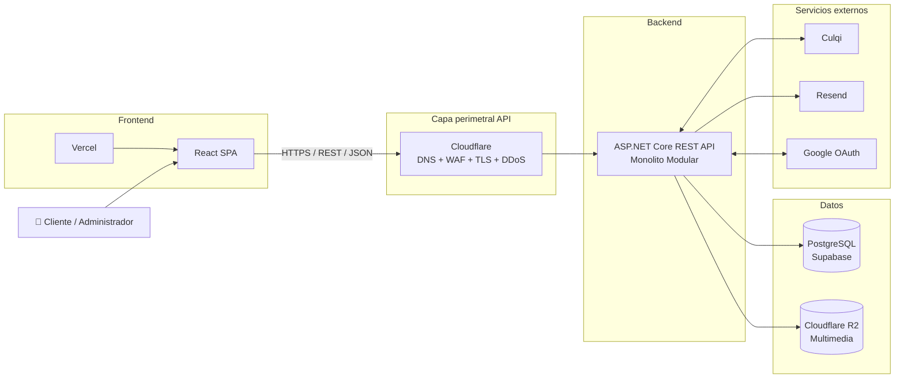
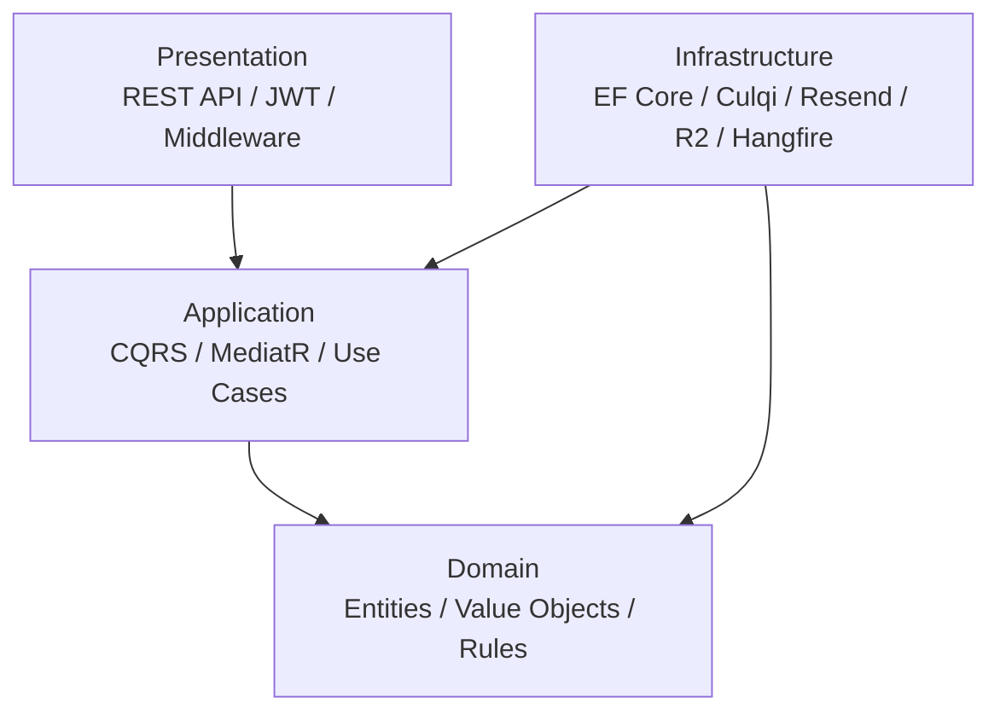
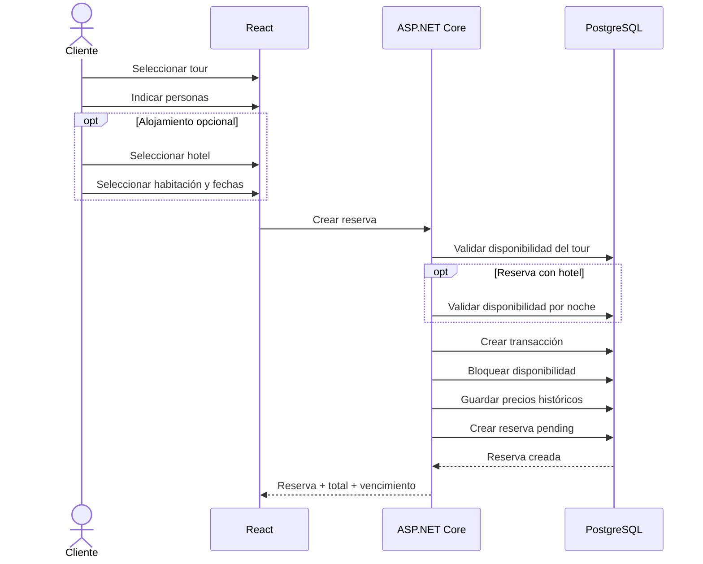
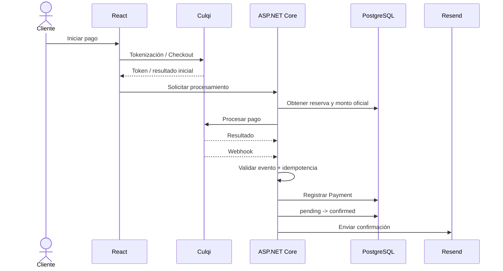
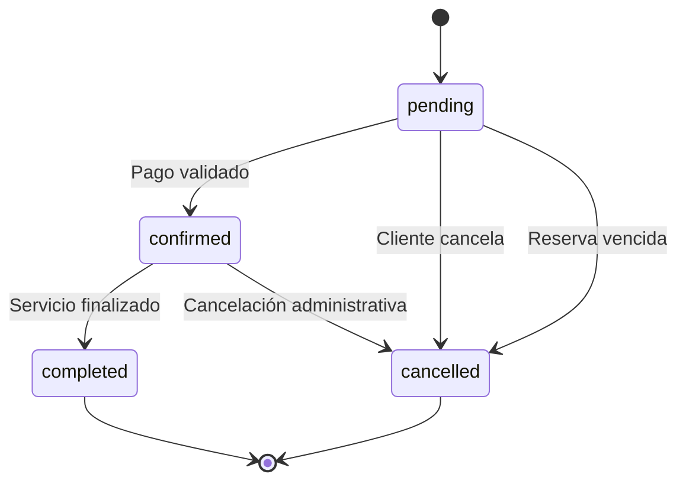

<div align="center">

# 🌎 DMGOTRAVEL

### Sistema Web para Agencia y Operadora Turística

**Plataforma integral para la gestión de servicios turísticos, hoteles, reservas, pagos y operación administrativa.**

<br>


<br>

**Arquitectura Cliente-Servidor · Monolito Modular · Clean Architecture · CQRS**

<br>

**Autor: Camilo Conde**

</div>

---

## 📑 Tabla de contenido

- [Descripción](#-descripción)
- [Objetivos](#-objetivos)
- [Estado actual](#-estado-actual)
- [Actores del sistema](#-actores-del-sistema)
- [Funcionalidades principales](#-funcionalidades-principales)
- [Arquitectura](#️-arquitectura)
- [Arquitectura interna](#-arquitectura-interna)
- [Módulos del monolito](#-módulos-del-monolito)
- [Stack tecnológico](#️-stack-tecnológico)
- [Flujo de reserva](#-flujo-de-reserva)
- [Flujo de pago](#-flujo-de-pago)
- [Seguridad](#-seguridad)
- [Persistencia y concurrencia](#-persistencia-y-concurrencia)
- [Infraestructura y despliegue](#️-infraestructura-y-despliegue)
- [Estructura del repositorio](#️-estructura-del-repositorio)
- [Documentación](#-documentación)
- [Decisiones arquitectónicas](#-decisiones-arquitectónicas)
- [Roadmap](#️-roadmap)
- [Evolución futura](#-evolución-futura)
- [Convenciones](#-convenciones)
- [Autor](#-autor)

---

# 📌 Descripción

**DMGOTRAVEL** es una plataforma web orientada a una **agencia y operadora turística**, diseñada para centralizar la gestión de:

- servicios turísticos;
- tours y paquetes;
- hoteles;
- tipos de habitación;
- disponibilidad;
- reservas;
- pagos;
- comprobantes;
- clientes;
- auditoría;
- reportes administrativos.

La plataforma permite que los clientes consulten la oferta turística, seleccionen servicios, agreguen alojamiento de manera opcional, realicen reservas y efectúen pagos electrónicos desde una interfaz web.

Los administradores disponen de herramientas para gestionar el catálogo, hoteles, disponibilidad, reservas, clientes, auditoría e indicadores de operación.

> El backend se diseña como un **Monolito Modular en ASP.NET Core**, aplicando **Clean Architecture** y **CQRS con MediatR**, con persistencia en **PostgreSQL**.

---

# 🎯 Objetivos

DMGOTRAVEL busca:

- Centralizar la oferta turística y hotelera.
- Permitir reservas de servicios turísticos.
- Permitir reservas compuestas de **tour + hotel**.
- Gestionar disponibilidad de tours y habitaciones.
- Evitar sobreventa mediante control transaccional.
- Procesar pagos mediante **Culqi**.
- Enviar comprobantes mediante **Resend**.
- Gestionar autenticación local y acceso con Google.
- Automatizar el vencimiento de reservas pendientes.
- Conservar trazabilidad mediante auditoría.
- Utilizar almacenamiento externo para multimedia.
- Mantener una arquitectura simple de operar y preparada para crecer.
- Separar correctamente reglas de negocio, aplicación, infraestructura y presentación.

---

# 📊 Estado actual

> **Fase actual: análisis y diseño arquitectónico finalizado / preparación para implementación.**

| Área | Estado |
|---|:---:|
| Actores | ✅ |
| Historias de usuario | ✅ |
| Requisitos funcionales | ✅ |
| Reglas de negocio | ✅ |
| Atributos de calidad | ✅ |
| Restricciones | ✅ |
| Drivers arquitectónicos | ✅ |
| ADR | ✅ |
| Arquitectura inicial | ✅ |
| Estilo arquitectónico | ✅ |
| Clean Architecture | ✅ |
| Arquitectura de despliegue | ✅ |
| Modelo de dominio detallado | ⏳ |
| Modelo de datos / ERD | ⏳ |
| Contrato OpenAPI | ⏳ |
| Backend | ⏳ |
| Frontend | ⏳ |
| Pruebas | ⏳ |
| CI/CD | ⏳ |
| Producción | ⏳ |

---

# 👥 Actores del sistema

| Actor | Responsabilidad |
|---|---|
| 👤 **Cliente** | Consulta catálogo, realiza reservas, pagos y gestiona su perfil. |
| 🧑‍💼 **Administrador** | Gestiona catálogo, hoteles, reservas, clientes, reportes y auditoría. |
| 💳 **Culqi** | Procesa pagos y notifica eventos relacionados con las transacciones. |
| 🔐 **Google** | Proporciona autenticación externa mediante OAuth. |
| ✉️ **Resend** | Gestiona correos transaccionales y comprobantes. |
| ☁️ **Cloudflare R2** | Almacena archivos multimedia del catálogo. |
| ⚙️ **Hangfire** | Ejecuta trabajos persistentes y programados dentro del monolito. |

📄 Documentación:

[**01 — Actores del sistema**](./analisis-de-sistema/01-actores-del-sistema.md)

---

# ✨ Funcionalidades principales

## 👤 Cliente

El cliente podrá:

- explorar ofertas activas;
- consultar tours y paquetes;
- consultar hoteles;
- revisar tipos de habitación y tarifas;
- registrarse;
- iniciar sesión;
- autenticarse mediante Google;
- crear una reserva;
- agregar alojamiento opcional;
- conocer el precio total calculado por el backend;
- realizar pagos;
- recibir comprobantes;
- consultar historial de reservas;
- cancelar reservas pendientes;
- actualizar sus datos personales;
- solicitar la eliminación lógica de su cuenta.

---

## 🧑‍💼 Administrador

El administrador podrá:

- crear y modificar ofertas;
- activar o desactivar contenido;
- gestionar hoteles;
- gestionar tipos de habitación;
- administrar inventario;
- controlar precios;
- consultar reservas;
- gestionar estados permitidos;
- consultar clientes;
- consultar auditoría;
- consultar indicadores;
- generar reportes administrativos.

---

## ⚙️ Automatización

El sistema ejecutará procesos automáticos para:

- detectar reservas pendientes vencidas;
- cancelar reservas expiradas;
- liberar cupos turísticos;
- liberar inventario hotelero;
- ejecutar reintentos controlados;
- registrar operaciones automáticas.

---

# 🏗️ Arquitectura

DMGOTRAVEL utiliza una arquitectura **Cliente-Servidor**.

El frontend y backend son aplicaciones independientes, pero el backend de negocio permanece como **un único Monolito Modular**.



### Características principales

- Frontend desacoplado.
- API REST.
- Monolito Modular.
- Clean Architecture.
- CQRS.
- Persistencia relacional.
- Integraciones externas desacopladas.
- Cloudflare como capa perimetral de la API.
- Sin API Gateway independiente en la primera versión.

📄 [Arquitectura inicial](./arquitectura/arquitectura-inicial.md)

---

# 🧩 Arquitectura interna

El backend utiliza **Clean Architecture**.



## Capas

| Capa | Responsabilidad |
|---|---|
| 🟡 **Domain** | Entidades, Value Objects, invariantes y reglas del negocio. |
| 🟢 **Application** | Commands, Queries, handlers, DTOs, validaciones e interfaces. |
| 🟣 **Infrastructure** | EF Core, PostgreSQL, Identity, Culqi, Resend, R2 y Hangfire. |
| 🔵 **Presentation** | REST API, JWT, RBAC, middleware, OpenAPI y ProblemDetails. |

### Regla de dependencia

```text
Presentation ---> Application ---> Domain

Infrastructure ---> Application
Infrastructure ---> Domain
```

Las reglas del dominio no dependen de infraestructura.

📄 [Enfoque arquitectónico](./arquitectura/enfoque/enfoque-arquitectonico.md)

---

# 📦 Módulos del monolito

El backend está organizado mediante módulos funcionales.

```text
DMGOTRAVEL
│
├── Identity
│   ├── Users
│   ├── Authentication
│   └── Roles
│
├── Catalog
│   ├── Tours
│   ├── Services
│   └── Packages
│
├── Hotels
│   ├── Hotels
│   ├── RoomTypes
│   └── Availability
│
├── Reservations
│
├── Payments
│
├── Notifications
│
├── Reports
│
├── Audit
│
└── Background Jobs
```

> Los módulos **no son microservicios**. Todos forman parte de la misma aplicación backend y se despliegan juntos.

---

# 🛠️ Stack tecnológico

## Frontend

| Tecnología | Uso |
|---|---|
| **React** | Interfaz web. |
| **JavaScript / TypeScript** | Desarrollo frontend. |
| **Vercel** | Hosting del frontend. |

---

## Backend

| Tecnología | Uso |
|---|---|
| **ASP.NET Core** | Backend y API REST. |
| **C#** | Lenguaje principal. |
| **MediatR** | CQRS y casos de uso. |
| **FluentValidation** | Validación. |
| **Hangfire** | Background Jobs. |
| **ASP.NET Core Identity** | Gestión de identidad. |
| **JWT** | Autenticación de API. |
| **OpenAPI / Swagger** | Contrato y documentación de API. |
| **ProblemDetails** | Formato estándar de errores. |

---

## Persistencia

| Tecnología | Uso |
|---|---|
| **PostgreSQL** | Base de datos relacional. |
| **Supabase** | PostgreSQL gestionado. |
| **Entity Framework Core** | ORM. |
| **Npgsql** | Proveedor PostgreSQL para .NET. |

---

## Infraestructura

| Tecnología | Uso |
|---|---|
| **Docker** | Contenedor del backend. |
| **Render** | Hosting del backend. |
| **Cloudflare** | DNS, WAF, TLS y DDoS. |
| **Cloudflare R2** | Almacenamiento multimedia. |
| **Vercel** | Hosting del frontend. |

---

## Servicios externos

| Servicio | Uso |
|---|---|
| **Culqi** | Pagos electrónicos. |
| **Resend** | Correos transaccionales. |
| **Google OAuth** | Autenticación social. |

---

# 🔄 Flujo de reserva

Una reserva puede ser:

```text
Tour
```

o:

```text
Tour + Hotel
```

El hotel es opcional.



### Principios

- El backend calcula el precio.
- La reserva nace en `pending`.
- La disponibilidad se controla transaccionalmente.
- No deben existir reservas parciales.
- El precio histórico no cambia si cambia posteriormente el catálogo.

---

# 💳 Flujo de pago



### Regla principal

```text
pending -> confirmed
```

solo ocurre después de validar un pago exitoso.

El administrador no utilizará un cambio manual de estado como sustituto de la confirmación de pago.

---

# 🔐 Seguridad

DMGOTRAVEL contempla seguridad en diferentes niveles.

## Autenticación

```text
ASP.NET Core Identity
JWT
Google OAuth
```

---

## Autorización

RBAC:

```text
Roles
├── client
└── admin
```

Ejemplo:

```text
/api/v1/admin/*
        |
        v
RequireRole("admin")
```

---

## API

Se aplicarán:

- HTTPS;
- JWT;
- CORS restrictivo;
- rate limiting;
- validación de entrada;
- autorización por recurso;
- `ProblemDetails`;
- logging estructurado;
- `CorrelationId`;
- OpenAPI;
- protección de endpoints administrativos.

---

## Pagos

El backend:

- no confía en precios enviados por React;
- no almacena datos sensibles completos de tarjetas;
- valida eventos recibidos de Culqi;
- aplica idempotencia;
- conserva identificadores externos;
- confirma reservas únicamente después del pago válido.

---

## Infraestructura

Cloudflare aportará:

- WAF;
- TLS;
- mitigación DDoS;
- DNS;
- reglas perimetrales.

---

# 🗄️ Persistencia y concurrencia

La persistencia utilizará:

```text
ASP.NET Core
     |
Entity Framework Core
     |
Npgsql
     |
PostgreSQL / Supabase
```

React no accederá directamente a PostgreSQL.

---

## Control de concurrencia

Los procesos de reserva deberán utilizar:

- transacciones;
- estrategia explícita de bloqueo;
- restricciones de base de datos;
- índices;
- idempotencia;
- rollback ante fallos.

Ejemplo conceptual:

```text
BEGIN TRANSACTION

Validar salida turística
Bloquear / controlar inventario
Validar cupos

SI hay hotel:
    validar rango de fechas
    bloquear inventario por noche
    validar disponibilidad

calcular precio
crear reserva
crear componentes
guardar snapshots

COMMIT
```

Ante fallo:

```text
ROLLBACK
```

---

# ☁️ Infraestructura y despliegue

## Frontend

```text
dmgotravel.com
www.dmgotravel.com
        |
        v
      Vercel
        |
        v
     React SPA
```

Cloudflare puede utilizarse como proveedor DNS para el dominio del frontend.

---

## API

```text
api.dmgotravel.com
        |
        v
Cloudflare Proxy
DNS / WAF / TLS / DDoS
        |
        v
      Render
        |
        v
ASP.NET Core REST API
Monolito Modular
```

---

## Datos e integraciones

```text
ASP.NET Core
   |
   +------> PostgreSQL / Supabase
   |
   +------> Cloudflare R2
   |
   +------> Culqi
   |
   +------> Resend
   |
   +------> Google OAuth
```

📄 [Arquitectura de despliegue](./arquitectura/arquitectura-de-despliegue.md)

---

# 🗂️ Estructura del repositorio

## Estado documental actual

```text
DMGoTravell/
│
├── README.md
│
├── analisis-de-sistema/
│   ├── 01-actores-del-sistema.md
│   ├── 02-historias-de-usuario.md
│   ├── 03-requisitos-funcionales.md
│   ├── 04-atributos-de-calidad.md
│   ├── 05-restricciones.md
│   ├── 06-drivers-arquitectonicos.md
│   └── 07-decisiones-arquitectonicas.md
│
└── arquitectura/
    ├── README.md
    ├── arquitectura-inicial.md
    ├── estilo-arquitectonico.md
    ├── arquitectura-de-despliegue.md
    │
    └── enfoque/
        └── enfoque-arquitectonico.md
```

---

## Estructura prevista para implementación

```text
DMGoTravell/
│
├── src/
│   ├── DMGOTRAVEL.Api/
│   ├── DMGOTRAVEL.Application/
│   ├── DMGOTRAVEL.Domain/
│   └── DMGOTRAVEL.Infrastructure/
│
├── tests/
│   ├── DMGOTRAVEL.Domain.Tests/
│   ├── DMGOTRAVEL.Application.Tests/
│   ├── DMGOTRAVEL.IntegrationTests/
│   └── DMGOTRAVEL.ArchitectureTests/
│
├── frontend/
│
├── analisis-de-sistema/
│
├── arquitectura/
│
├── .github/
│   └── workflows/
│
├── Dockerfile
│
└── README.md
```

> La estructura definitiva de código se documentará antes del inicio de la implementación.

---

# 📚 Documentación

## Análisis del sistema

| N.º | Documento | Contenido |
|---:|---|---|
| 01 | [Actores del sistema](./analisis-de-sistema/01-actores-del-sistema.md) | Usuarios, sistemas externos y procesos automáticos. |
| 02 | [Historias de usuario](./analisis-de-sistema/02-historias-de-usuario.md) | Necesidades y criterios de aceptación. |
| 03 | [Requisitos funcionales](./analisis-de-sistema/03-requisitos-funcionales.md) | Funcionalidades, reglas y trazabilidad. |
| 04 | [Atributos de calidad](./analisis-de-sistema/04-atributos-de-calidad.md) | Rendimiento, seguridad, integridad y calidad. |
| 05 | [Restricciones](./analisis-de-sistema/05-restricciones.md) | Restricciones tecnológicas y operativas. |
| 06 | [Drivers arquitectónicos](./analisis-de-sistema/06-drivers-arquitectonicos.md) | Necesidades que condicionan la arquitectura. |
| 07 | [Decisiones arquitectónicas](./analisis-de-sistema/07-decisiones-arquitectonicas.md) | ADR oficiales del proyecto. |

---

## Arquitectura

| Documento | Contenido |
|---|---|
| [Arquitectura inicial](./arquitectura/arquitectura-inicial.md) | Vista general de componentes. |
| [Estilo arquitectónico](./arquitectura/estilo-arquitectonico.md) | Cliente-Servidor, Monolito Modular, Clean Architecture y CQRS. |
| [Enfoque arquitectónico](./arquitectura/enfoque/enfoque-arquitectonico.md) | Organización interna y dependencias. |
| [Arquitectura de despliegue](./arquitectura/arquitectura-de-despliegue.md) | Cloudflare, Vercel, Render, Supabase y servicios externos. |

---

# 🧭 Decisiones arquitectónicas

Las principales decisiones son:

| ADR | Decisión |
|---|---|
| **ADR-001** | Monolito Modular con ASP.NET Core. |
| **ADR-002** | Clean Architecture. |
| **ADR-003** | CQRS con MediatR. |
| **ADR-004** | PostgreSQL + Supabase. |
| **ADR-005** | Hangfire para Background Jobs. |
| **ADR-006** | Cloudflare R2 para multimedia. |
| **ADR-007** | Culqi como pasarela de pago. |
| **ADR-008** | Resend para correo transaccional. |
| **ADR-009** | ASP.NET Core Identity + JWT + Google OAuth. |
| **ADR-010** | Borrado lógico. |
| **ADR-011** | Snapshots de precios. |
| **ADR-012** | React + Vercel. |
| **ADR-013** | Docker + Render. |
| **ADR-014** | Cloudflare como capa perimetral. |
| **ADR-015** | OpenAPI. |
| **ADR-016** | ProblemDetails. |
| **ADR-017** | API Gateway independiente diferido / no adoptado inicialmente. |

📄 [Decisiones arquitectónicas completas](./analisis-de-sistema/07-decisiones-arquitectonicas.md)

---

# 🛣️ Roadmap

## Fase 1 — Análisis

- [x] Actores.
- [x] Historias de usuario.
- [x] Criterios de aceptación.
- [x] Requisitos funcionales.
- [x] Reglas de negocio.
- [x] Atributos de calidad.
- [x] Restricciones.

---

## Fase 2 — Arquitectura

- [x] Drivers arquitectónicos.
- [x] ADR.
- [x] Monolito Modular.
- [x] Clean Architecture.
- [x] CQRS.
- [x] Arquitectura inicial.
- [x] Arquitectura de despliegue.

---

## Fase 3 — Diseño técnico

- [ ] Modelo de dominio.
- [ ] Modelo entidad-relación.
- [ ] Diccionario de datos.
- [ ] Diseño de disponibilidad turística.
- [ ] Diseño de inventario hotelero.
- [ ] Modelo de pagos.
- [ ] Contrato REST / OpenAPI.
- [ ] Estrategia de autenticación.
- [ ] Estrategia de errores.
- [ ] Estrategia de concurrencia.

---

## Fase 4 — Backend

- [ ] Crear solución .NET.
- [ ] Domain.
- [ ] Application.
- [ ] Infrastructure.
- [ ] Presentation.
- [ ] EF Core.
- [ ] Identity.
- [ ] JWT.
- [ ] CQRS.
- [ ] Hangfire.
- [ ] OpenAPI.

---

## Fase 5 — Frontend

- [ ] Crear aplicación React.
- [ ] Diseño responsive.
- [ ] Catálogo.
- [ ] Hoteles.
- [ ] Reserva.
- [ ] Checkout.
- [ ] Perfil.
- [ ] Historial.
- [ ] Panel administrativo.

---

## Fase 6 — Integraciones

- [ ] Culqi.
- [ ] Resend.
- [ ] Google OAuth.
- [ ] Cloudflare R2.

---

## Fase 7 — Calidad

- [ ] Pruebas unitarias.
- [ ] Pruebas de integración.
- [ ] Pruebas de arquitectura.
- [ ] Pruebas de concurrencia.
- [ ] Pruebas de seguridad.
- [ ] Pruebas de rendimiento.

---

## Fase 8 — DevOps

- [ ] Docker.
- [ ] GitHub Actions.
- [ ] Variables de entorno.
- [ ] Health Checks.
- [ ] Logging estructurado.
- [ ] Monitoreo.
- [ ] Backups.
- [ ] Despliegue productivo.

---

# 🔮 Evolución futura

La arquitectura inicial prioriza simplicidad y consistencia.

```text
Monolito Modular
      |
      v
Escalado vertical
      |
      v
Escalado horizontal
      |
      v
Caché distribuida si es necesaria
      |
      v
Workers separados si son necesarios
      |
      v
API Gateway si existe una necesidad real
      |
      v
Servicios independientes
      |
      v
Microservicios
solo si existe justificación técnica
```

> DMGOTRAVEL no adopta microservicios ni API Gateway como objetivo inicial. La evolución arquitectónica debe responder a necesidades reales del sistema.

---

# 📐 Convenciones

## API

```text
/api/v1/...
```

Ejemplos:

```text
/api/v1/auth
/api/v1/catalog
/api/v1/hotels
/api/v1/reservations
/api/v1/payments
/api/v1/admin
/api/v1/webhooks
```

---

## Estados de reserva

```text
pending
confirmed
completed
cancelled
```

Ciclo principal:



---

## Roles

```text
client
admin
```

---

## Base de datos

- PostgreSQL.
- Migraciones mediante EF Core.
- Soft delete cuando corresponda.
- UTC para fechas de servidor.
- Restricciones e índices a nivel de base de datos.
- Snapshots de precios para información histórica.

---

## Seguridad de secretos

Los secretos se gestionarán mediante variables de entorno.

Ejemplos:

```text
ConnectionStrings__DefaultConnection

Jwt__Key
Jwt__Issuer
Jwt__Audience

Culqi__PublicKey
Culqi__SecretKey

Resend__ApiKey

Google__ClientId
Google__ClientSecret

R2__AccountId
R2__AccessKeyId
R2__SecretAccessKey
R2__BucketName
```

> Nunca se deben almacenar secretos reales en GitHub.

---

# 🤝 Flujo de trabajo

Convención sugerida:

```bash
git checkout -b feature/nombre-funcionalidad
git add .
git commit -m "feat: implementar funcionalidad"
git push origin feature/nombre-funcionalidad
```

Tipos de commit recomendados:

```text
feat:
fix:
docs:
refactor:
test:
chore:
ci:
```

---

# 👨‍💻 Autor

<div align="center">

### Camilo Conde

**Ingeniería de Sistemas**

Arquitectura, análisis y desarrollo de **DMGOTRAVEL**

<br>

**Ayacucho — Perú**

</div>

---

# 📄 Licencia

Este repositorio corresponde a un proyecto académico y de desarrollo de software.

La documentación, código, diagramas y recursos del proyecto deben utilizarse respetando la autoría correspondiente.

---

<div align="center">

## 🌎 DMGOTRAVEL

### Travel Management Platform

**React · ASP.NET Core · Modular Monolith · Clean Architecture · CQRS · PostgreSQL**

<br>

**Autor**

### Camilo Conde

</div>
