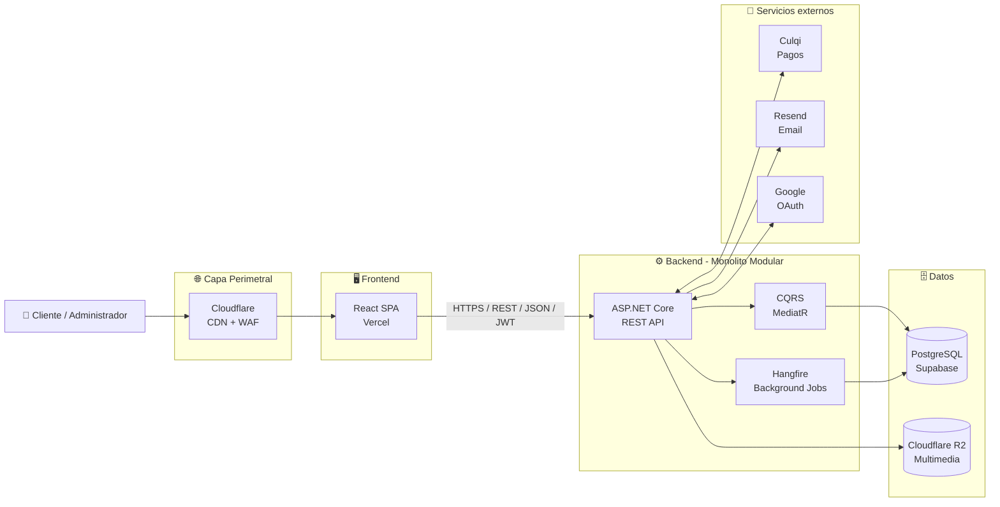
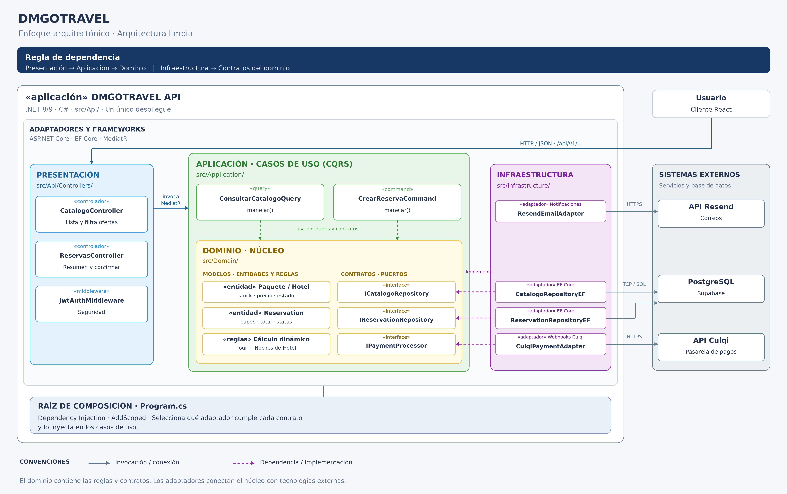
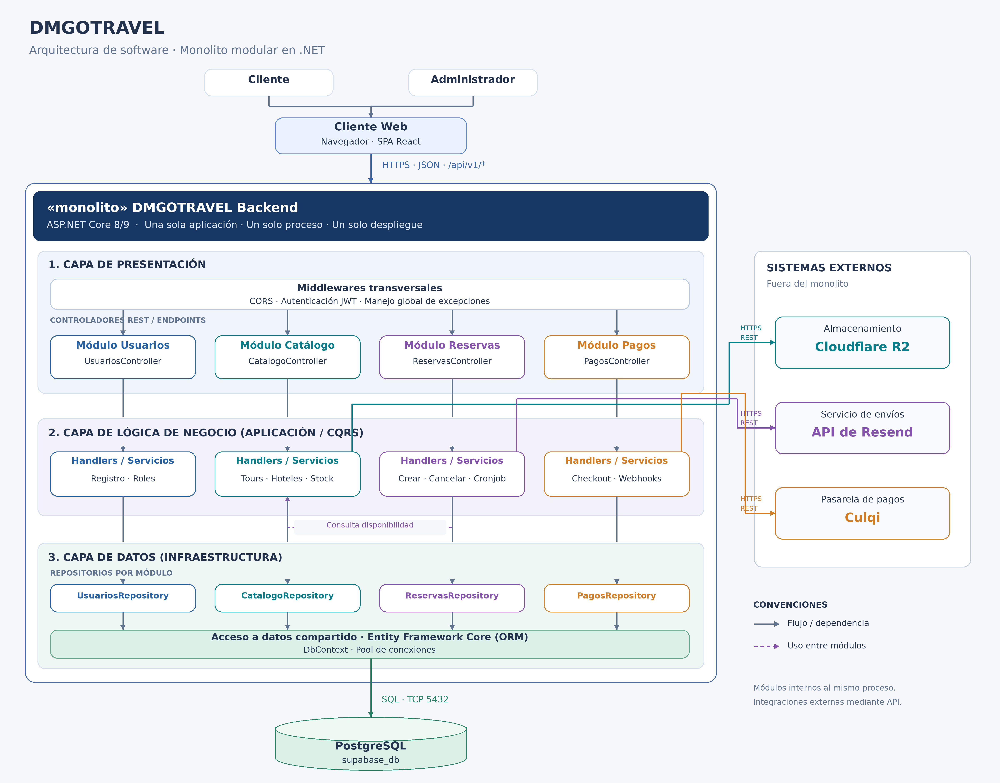
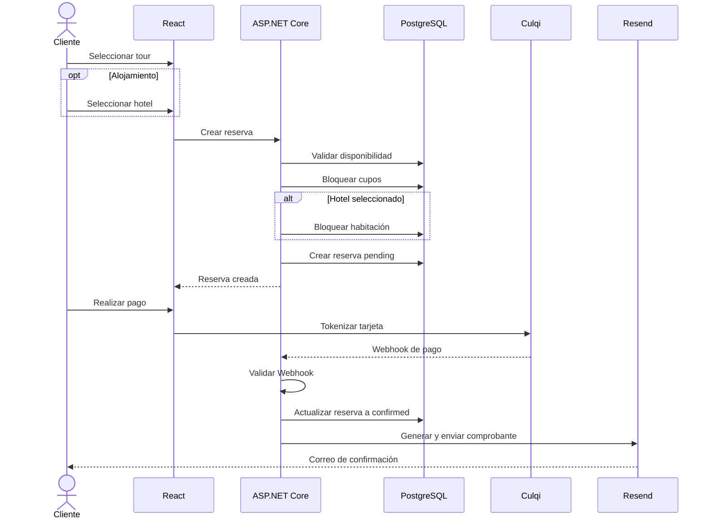
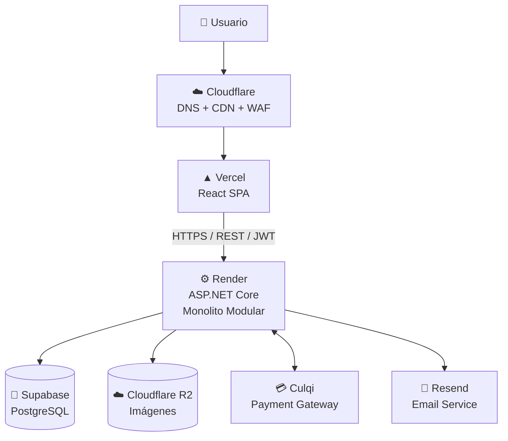

<div align="center">

# 🌎 DMGOTRAVEL

### Sistema Web para Agencia y Operadora Turística

**Plataforma para la gestión de servicios turísticos, hoteles, reservas y pagos**

<br>

**Autor: Camilo Conde**

</div>

---

## 📑 Tabla de contenido

- [Descripción](#-descripción)
- [Objetivos del sistema](#-objetivos-del-sistema)
- [Actores del sistema](#-actores-del-sistema)
- [Funcionalidades principales](#-funcionalidades-principales)
- [Arquitectura del sistema](#️-arquitectura-del-sistema)
- [Enfoque arquitectónico](#-enfoque-arquitectónico)
- [Estilo arquitectónico](#-estilo-arquitectónico)
- [Tecnologías](#️-tecnologías)
- [Módulos principales](#-módulos-principales)
- [Flujo de reserva y pago](#-flujo-de-reserva-y-pago)
- [Seguridad](#-seguridad)
- [Atributos de calidad](#-atributos-de-calidad)
- [Estructura del repositorio](#️-estructura-del-repositorio)
- [Documentación](#-documentación)
- [Decisiones arquitectónicas](#-decisiones-arquitectónicas)
- [Infraestructura propuesta](#️-infraestructura-propuesta)
- [Estado del proyecto](#-estado-del-proyecto)
- [Roadmap](#️-roadmap)
- [Autor](#-autor)

---

# 📌 Descripción

**DMGOTRAVEL** es una propuesta de sistema web orientada a una **agencia y operadora turística**, diseñada para centralizar la gestión de servicios turísticos, paquetes, hoteles, habitaciones, reservas, pagos y actividades administrativas.

La plataforma permitirá que los clientes puedan consultar la oferta turística disponible, seleccionar servicios, agregar alojamiento de manera opcional, realizar reservas y efectuar pagos electrónicos desde una interfaz web.

Por otro lado, los administradores podrán gestionar el catálogo turístico, hoteles, disponibilidad, reservas, clientes, auditoría e indicadores relacionados con la operación de la agencia.

La solución está diseñada bajo una arquitectura **Cliente-Servidor**, utilizando un backend basado en un **Monolito Modular desarrollado con ASP.NET Core**, estructurado mediante los principios de **Clean Architecture** y complementado con el patrón **CQRS**.

Actualmente, este repositorio contiene principalmente la documentación correspondiente al **análisis del sistema y diseño arquitectónico**, que constituye la base para la posterior implementación del software.

---

# 🎯 Objetivos del sistema

El sistema DMGOTRAVEL busca:

- Centralizar la oferta de servicios turísticos.
- Gestionar tours, paquetes turísticos y alojamiento.
- Permitir reservas simples de servicios turísticos.
- Permitir reservas compuestas de **tour + hotel**.
- Gestionar disponibilidad y cupos en tiempo real.
- Evitar la sobreventa de servicios y habitaciones.
- Automatizar el procesamiento de reservas.
- Integrar pagos electrónicos mediante **Culqi**.
- Enviar comprobantes mediante **Resend**.
- Automatizar la cancelación de reservas pendientes vencidas.
- Mantener registros de auditoría de operaciones críticas.
- Brindar herramientas administrativas para supervisar la plataforma.
- Disponer de una arquitectura mantenible y preparada para crecer.

---

# 👥 Actores del sistema

DMGOTRAVEL identifica actores humanos, servicios externos y procesos automatizados.

| Actor | Responsabilidad |
|---|---|
| 👤 **Cliente** | Consulta servicios turísticos, hoteles, realiza reservas, pagos y administra sus datos. |
| 🧑‍💼 **Administrador** | Gestiona catálogo, hoteles, reservas, clientes, auditoría e indicadores. |
| 💳 **Culqi** | Procesa pagos electrónicos y notifica su resultado mediante Webhooks. |
| ✉️ **Resend** | Gestiona el envío de correos y comprobantes electrónicos. |
| 🔐 **Google** | Proporciona autenticación externa mediante OAuth. |
| ⚙️ **Sistema de tareas** | Ejecuta procesos automáticos como la cancelación de reservas vencidas. |

📄 Documentación completa:

[**01 - Actores del sistema**](./analisis-de-sistema/01-actores_del_sistema.md)

---

# ✨ Funcionalidades principales

## 👤 Cliente

El cliente podrá:

- Consultar el catálogo público.
- Explorar servicios turísticos.
- Consultar paquetes disponibles.
- Consultar hoteles.
- Visualizar habitaciones y tarifas.
- Consultar disponibilidad.
- Registrarse en el sistema.
- Iniciar sesión.
- Autenticarse mediante un proveedor externo.
- Crear una reserva turística.
- Añadir alojamiento opcional.
- Consultar el precio total antes de pagar.
- Realizar pagos electrónicos.
- Recibir un comprobante de pago.
- Consultar el historial de reservas.
- Consultar el estado de una reserva.
- Cancelar reservas pendientes.
- Actualizar sus datos personales.
- Solicitar la eliminación lógica de su cuenta.

---

## 🧑‍💼 Administrador

El administrador podrá:

- Crear servicios turísticos.
- Modificar servicios turísticos.
- Desactivar servicios del catálogo.
- Gestionar paquetes turísticos.
- Registrar hoteles.
- Gestionar habitaciones.
- Administrar precios.
- Controlar disponibilidad.
- Consultar reservas.
- Gestionar estados de reservas.
- Consultar clientes.
- Consultar registros de auditoría.
- Visualizar indicadores.
- Exportar información administrativa a PDF.

---

## ⚙️ Automatización

El sistema contará con procesos automatizados para:

- Detectar reservas pendientes vencidas.
- Cancelar automáticamente reservas sin pago.
- Liberar cupos turísticos.
- Liberar habitaciones bloqueadas.
- Registrar operaciones automáticas.
- Ejecutar tareas en segundo plano.

---

# 🏗️ Arquitectura del sistema

DMGOTRAVEL utiliza una arquitectura **Cliente-Servidor**, donde la aplicación frontend y el backend se encuentran desacoplados.



---

# 🧩 Enfoque arquitectónico

La organización interna del backend se basa en **Clean Architecture**.

Este enfoque permite separar las reglas del negocio de tecnologías específicas como bases de datos, APIs externas, servicios de almacenamiento o frameworks.

<p align="center">
  
</p>

La arquitectura se organiza principalmente en cuatro capas:

| Capa | Responsabilidad |
|---|---|
| 🟡 **Domain** | Entidades, reglas de negocio, Value Objects y contratos principales. |
| 🟢 **Application** | Casos de uso, Commands, Queries, DTO, validaciones e interfaces. |
| 🟣 **Infrastructure** | Entity Framework Core, PostgreSQL, Culqi, Resend, almacenamiento y servicios externos. |
| 🔵 **Presentation** | API REST, controladores, middleware, seguridad y comunicación HTTP. |

---

## Principios utilizados

- Separación de responsabilidades.
- Inversión de dependencias.
- Bajo acoplamiento.
- Alta cohesión.
- Dominio independiente.
- Testabilidad.
- Modularidad.
- Mantenibilidad.
- Escalabilidad.
- Integraciones desacopladas.

---

# 🏛️ Estilo arquitectónico

DMGOTRAVEL combina diferentes estilos, patrones y principios arquitectónicos.

## Cliente-Servidor

El frontend y backend funcionan como aplicaciones independientes y se comunican mediante HTTP utilizando una API REST.

---

## Monolito Modular

El backend se despliega como una sola aplicación.

Sin embargo, internamente se divide en módulos funcionales con responsabilidades claramente definidas.

Esto proporciona la simplicidad operacional de un monolito sin perder una adecuada separación lógica del sistema.

---

## Clean Architecture

Las dependencias del sistema apuntan hacia las capas internas.

La lógica del negocio no depende directamente de:

- PostgreSQL.
- Culqi.
- Resend.
- Cloudflare.
- Frameworks externos.
- Servicios de infraestructura.

---

## CQRS

Se utiliza **Command Query Responsibility Segregation** para diferenciar las operaciones que modifican información de aquellas que únicamente realizan consultas.

### Commands

Operaciones que modifican el sistema.

Ejemplos:

```text
CrearReservaCommand
ConfirmarPagoCommand
CancelarReservaCommand
CrearHotelCommand
ActualizarOfertaCommand
```

### Queries

Operaciones orientadas a lectura.

Ejemplos:

```text
ObtenerCatalogoQuery
ObtenerOfertaQuery
ObtenerHotelesQuery
ObtenerReservasQuery
ObtenerHistorialQuery
```

---

<p align="center">
  
</p>

---

# 🛠️ Tecnologías

## Frontend

- React
- JavaScript

---

## Backend

- ASP.NET Core
- C#
- REST API
- Entity Framework Core
- MediatR
- FluentValidation
- Hangfire

---

## Base de datos

- PostgreSQL.
- Entity Framework Core.
- Supabase.
- Transacciones ACID.
- Control de concurrencia.
- Borrado lógico.

---

## Infraestructura

- Cloudflare CDN.
- Cloudflare WAF.
- Cloudflare R2.
- Vercel.
- Render.
- Docker.
- Namecheap.

---

## Servicios externos

| Servicio | Uso |
|---|---|
| **Culqi** | Procesamiento de pagos. |
| **Resend** | Correos transaccionales. |
| **Google OAuth** | Autenticación externa. |
| **Cloudflare R2** | Almacenamiento multimedia. |
| **Supabase** | PostgreSQL gestionado. |
| **Vercel** | Hosting frontend. |
| **Render** | Hosting backend. |

---

# 📦 Módulos principales

El backend se plantea como un **Monolito Modular**.

```text
DMGOTRAVEL
│
├── 👤 Identity
│   ├── Users
│   ├── Authentication
│   └── Roles
│
├── 🧳 Catalog
│   ├── Tours
│   ├── Services
│   └── Packages
│
├── 🏨 Hotels
│   ├── Hotels
│   ├── Rooms
│   └── Availability
│
├── 📅 Reservations
├── 💳 Payments
├── 📧 Notifications
├── 📊 Reports
├── 📝 Audit
└── ⚙️ Background Jobs
```

Los módulos comparten la misma aplicación y proceso de despliegue, pero mantienen responsabilidades independientes.

---

# 🔄 Flujo de reserva y pago

El flujo principal del sistema puede representarse de la siguiente manera:



---

# 🔐 Seguridad

La arquitectura contempla diferentes mecanismos para proteger la plataforma.

### Autenticación

- JSON Web Tokens (**JWT**).
- Autenticación centralizada.
- Integración OAuth.
- Manejo de identidad de usuarios.

### Autorización

Se utiliza control basado en roles:

```text
RBAC
├── Client
└── Admin
```

### API

La comunicación se realizará mediante:

```text
HTTPS
REST
JSON
JWT
```

### Pagos

Para las operaciones realizadas mediante Culqi:

- La tarjeta es tokenizada.
- El backend no debe confiar en montos proporcionados por el frontend.
- El precio final se calcula en el servidor.
- Se validan los Webhooks.
- Se controla la idempotencia de operaciones.
- La reserva se confirma únicamente después de validar el pago.

### Infraestructura

Cloudflare proporciona una capa perimetral para:

- CDN.
- WAF.
- Protección DDoS.
- Gestión DNS.
- TLS/HTTPS.

---

# ⚡ Atributos de calidad

La arquitectura del sistema considera los siguientes atributos:

| Atributo | Estrategia |
|---|---|
| ⚡ **Rendimiento** | Caché y consultas optimizadas. |
| 🌐 **Disponibilidad** | Procesos en background independientes del flujo HTTP. |
| 📈 **Escalabilidad** | Backend stateless preparado para replicación. |
| 🔐 **Seguridad** | JWT, RBAC, HTTPS, WAF y validación de integraciones. |
| 🧩 **Mantenibilidad** | Clean Architecture y modularización. |
| 🔄 **Integridad** | Transacciones ACID y control de concurrencia. |
| 🔌 **Interoperabilidad** | API REST y contratos JSON. |
| 📝 **Trazabilidad** | Auditoría de acciones críticas. |
| 👨‍💻 **Usabilidad** | Información clara sobre reservas y pagos. |

---

# 🗂️ Estructura del repositorio

```text
DMGoTravell/
│
├── analisis-de-sistema/
│   ├── 01-actores_del_sistema.md
│   ├── 02-historias-del-usuario.md
│   ├── 03-requisitos-funcionales.md
│   ├── 04-atributos-de-calidad.md
│   ├── 05-restricciones.md
│   ├── 06-driver-arquitectonicas.md
│   └── 07-desiciones-arquitectonicas.md
│
├── arquitectura/
│   ├── arquitectura-inicial.md
│   ├── estilo-arquitectonico.md
│   ├── enfoque/
│   │   └── enfoque-arquitectonico.md
│   └── imagenes/
│       ├── DMGOTRAVEL-arquitectura-monolito.png
│       └── DMGOTRAVEL-enfoque.png
│
└── README.md
```

---

# 📚 Documentación

## 📋 Análisis del sistema

| N.º | Documento | Descripción |
|---:|---|---|
| 01 | [Actores del sistema](./analisis-de-sistema/01-actores_del_sistema.md) | Define actores humanos, sistemas externos y procesos automáticos. |
| 02 | [Historias de usuario](./analisis-de-sistema/02-historias-del-usuario.md) | Define necesidades y criterios de aceptación. |
| 03 | [Requisitos funcionales](./analisis-de-sistema/03-requisitos-funcionales.md) | Define funcionalidades y reglas de negocio. |
| 04 | [Atributos de calidad](./analisis-de-sistema/04-atributos-de-calidad.md) | Define características no funcionales de la solución. |
| 05 | [Restricciones](./analisis-de-sistema/05-restricciones.md) | Define restricciones tecnológicas y arquitectónicas. |
| 06 | [Drivers arquitectónicos](./analisis-de-sistema/06-driver-arquitectonicas.md) | Identifica necesidades que condicionan la arquitectura. |
| 07 | [Decisiones arquitectónicas](./analisis-de-sistema/07-desiciones-arquitectonicas.md) | Registra las decisiones fundamentales del diseño. |

---

## 🏗️ Arquitectura

| Documento | Descripción |
|---|---|
| [Arquitectura inicial](./arquitectura/arquitectura-inicial.md) | Vista general de componentes e infraestructura. |
| [Estilo arquitectónico](./arquitectura/estilo-arquitectonico.md) | Describe Cliente-Servidor, Monolito Modular, Clean Architecture y CQRS. |
| [Enfoque arquitectónico](./arquitectura/enfoque/enfoque-arquitectonico.md) | Describe la aplicación de Clean Architecture. |

---

# 🧭 Decisiones arquitectónicas

| ADR | Decisión |
|---|---|
| **ADR-001** | Implementar un Monolito Modular en .NET. |
| **ADR-002** | Utilizar Clean Architecture. |
| **ADR-003** | Aplicar CQRS con MediatR. |
| **ADR-004** | Utilizar PostgreSQL gestionado mediante Supabase. |
| **ADR-005** | Utilizar Hangfire para tareas en segundo plano. |
| **ADR-006** | Utilizar Cloudflare R2 para archivos multimedia. |
| **ADR-007** | Validar criptográficamente las confirmaciones de Culqi. |
| **ADR-008** | Utilizar Vercel y Cloudflare para la capa frontend y perimetral. |
| **ADR-009** | Utilizar borrado lógico para conservar información histórica. |

📄 [**Decisiones arquitectónicas completas**](./analisis-de-sistema/07-desiciones-arquitectonicas.md)

---

# ☁️ Infraestructura propuesta



---

# 📊 Estado del proyecto

> **Fase actual: Análisis y Diseño Arquitectónico**

- [x] Identificación de actores.
- [x] Historias de usuario.
- [x] Criterios de aceptación.
- [x] Requisitos funcionales.
- [x] Reglas de negocio.
- [x] Atributos de calidad.
- [x] Restricciones.
- [x] Drivers arquitectónicos.
- [x] Decisiones arquitectónicas.
- [x] Arquitectura inicial.
- [x] Definición del estilo arquitectónico.
- [x] Clean Architecture.
- [x] CQRS.
- [x] Arquitectura de despliegue.
- [ ] Implementación del backend.
- [ ] Implementación del frontend.
- [ ] Persistencia PostgreSQL.
- [ ] Integración Culqi.
- [ ] Integración Resend.
- [ ] Integración Cloudflare R2.
- [ ] Pruebas unitarias.
- [ ] Pruebas de integración.
- [ ] Pruebas de concurrencia.
- [ ] CI/CD.
- [ ] Monitoreo.
- [ ] Despliegue productivo.

---

# 🛣️ Roadmap

### Fase 1 — Análisis

- [x] Actores.
- [x] Historias de usuario.
- [x] Requisitos.
- [x] Reglas de negocio.
- [x] Atributos de calidad.

### Fase 2 — Arquitectura

- [x] Drivers arquitectónicos.
- [x] ADR.
- [x] Monolito Modular.
- [x] Clean Architecture.
- [ ] CQRS.
- [ ] Infraestructura.

### Fase 3 — Backend

- [ ] Crear solución ASP.NET Core.
- [ ] Implementar Domain.
- [ ] Implementar Application.
- [ ] Implementar Infrastructure.
- [ ] Implementar Presentation.
- [ ] Configurar Entity Framework Core.
- [ ] Implementar JWT.
- [ ] Implementar CQRS.
- [ ] Implementar Hangfire.

### Fase 4 — Frontend

- [ ] Implementar React.
- [ ] Catálogo.
- [ ] Hoteles.
- [ ] Reservas.
- [ ] Perfil de usuario.
- [ ] Panel administrativo.

### Fase 5 — Integraciones

- [ ] Culqi.
- [ ] Resend.
- [ ] Google OAuth.
- [ ] Cloudflare R2.

### Fase 6 — Calidad

- [ ] Pruebas unitarias.
- [ ] Pruebas de integración.
- [ ] Pruebas de seguridad.
- [ ] Pruebas de concurrencia.
- [ ] Pruebas de rendimiento.

### Fase 7 — Producción

- [ ] Docker.
- [ ] CI/CD.
- [ ] Vercel.
- [ ] Render.
- [ ] Supabase.
- [ ] Cloudflare.
- [ ] Observabilidad.
- [ ] Monitoreo.

---

# 🔮 Evolución arquitectónica

El proyecto inicia utilizando un **Monolito Modular**, debido a que proporciona:

- Menor complejidad operativa.
- Despliegue sencillo.
- Menor latencia interna.
- Menor costo de infraestructura.
- Mayor facilidad de mantenimiento inicial.
- Transacciones de negocio más sencillas.

```text
Monolito básico
      │
      ▼
Monolito Modular
      │
      ▼
Escalamiento horizontal
      │
      ▼
Separación de Workers
      │
      ▼
Servicios independientes
      │
      ▼
Microservicios
(solo si existe una necesidad real)
```

---

# 🤝 Contribución

1. Crear una rama desde `main`.
2. Realizar cambios relacionados con una responsabilidad específica.
3. Mantener actualizados los requisitos afectados.
4. Actualizar los ADR cuando exista una nueva decisión arquitectónica.
5. Mantener sincronizados los diagramas y documentos.
6. Crear un Pull Request explicando los cambios.

```bash
git checkout -b feature/nueva-funcionalidad
git add .
git commit -m "docs: actualizar arquitectura"
git push origin feature/nueva-funcionalidad
```

---

# 👨‍💻 Autor

<div align="center">

### Camilo Conde

**Ingeniería de Sistemas**

Arquitectura y diseño del sistema **DMGOTRAVEL**

</div>

---

# 📄 Licencia

Este repositorio corresponde a un proyecto académico y de desarrollo de software.

El código, documentación, diagramas y demás recursos del proyecto deberán utilizarse respetando la autoría correspondiente.

---

<div align="center">

## 🌎 DMGOTRAVEL

### Travel Management Platform

**Clean Architecture · Modular Monolith · CQRS · ASP.NET Core · React · PostgreSQL**

<br>

**Autor**

### Camilo Conde

<br>

⭐ Si este proyecto te resulta interesante, puedes marcar el repositorio con una estrella.

</div>
