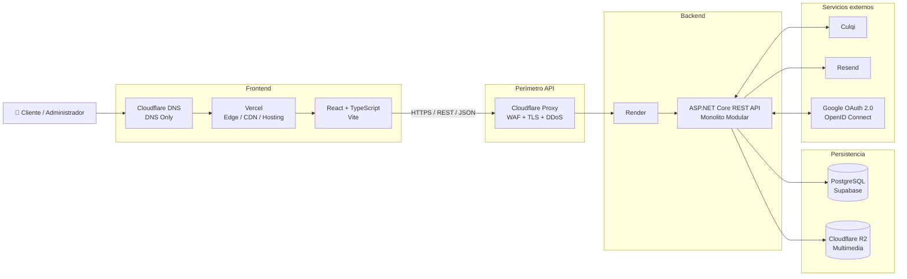
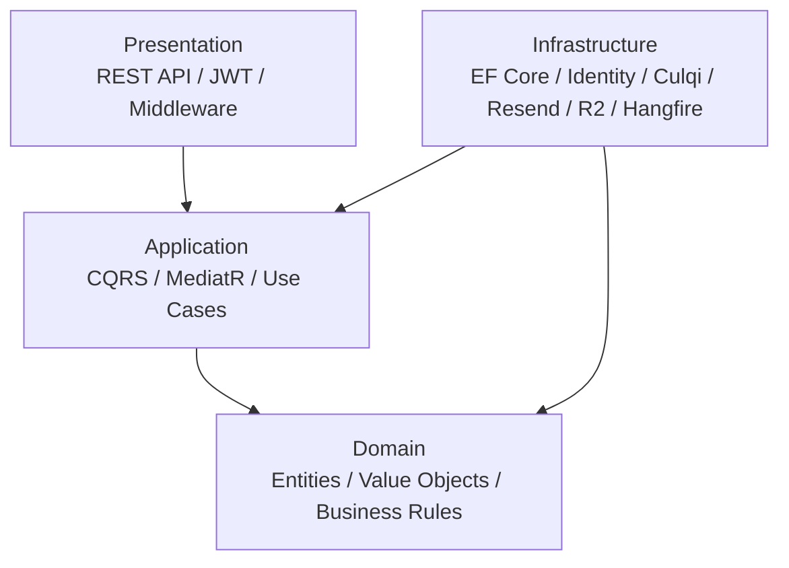
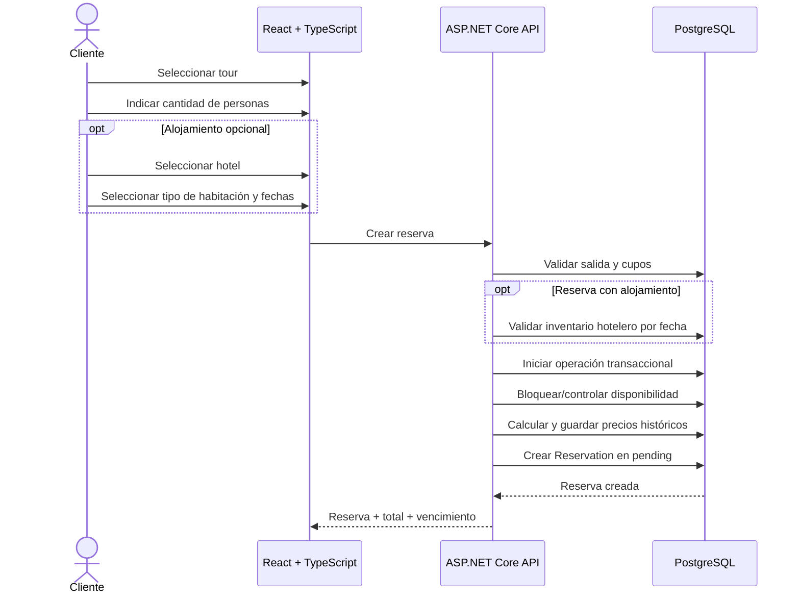
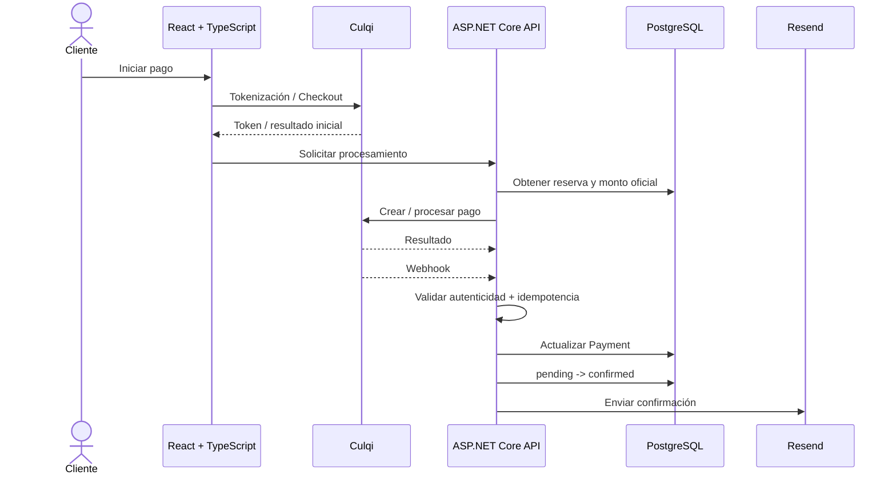
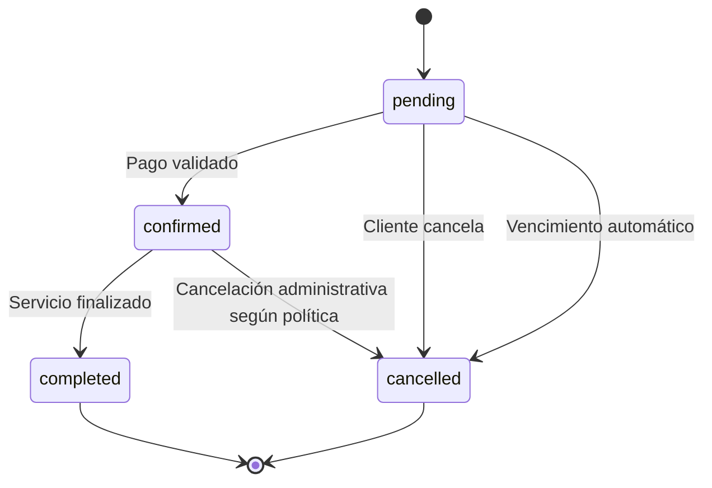

<div align="center">

# 🌎 DMGOTRAVEL

### Sistema Web para Agencia y Operadora Turística

**Plataforma integral para la gestión de servicios turísticos, hoteles, reservas, pagos, clientes y operación administrativa.**

<br>


<br>

**Cliente-Servidor · Monolito Modular · Clean Architecture · CQRS · REST API**

<br>

**Autor: Camilo Conde**

</div>

---

## 📑 Contenido

- [Descripción](#-descripción)
- [Estado del proyecto](#-estado-del-proyecto)
- [Objetivos](#-objetivos)
- [Actores](#-actores)
- [Funcionalidades](#-funcionalidades)
- [Arquitectura](#️-arquitectura)
- [Monolito Modular](#-monolito-modular)
- [Clean Architecture](#-clean-architecture)
- [Stack tecnológico](#️-stack-tecnológico)
- [Flujo de reserva](#-flujo-de-reserva)
- [Flujo de pago](#-flujo-de-pago)
- [Seguridad](#-seguridad)
- [Persistencia y concurrencia](#-persistencia-y-concurrencia)
- [Infraestructura y despliegue](#️-infraestructura-y-despliegue)
- [Metodología de implementación](#-metodología-de-implementación)
- [Estructura del repositorio](#️-estructura-del-repositorio)
- [Documentación](#-documentación)
- [Decisiones arquitectónicas](#-decisiones-arquitectónicas)
- [Roadmap](#️-roadmap)
- [Convenciones](#-convenciones)
- [Autor](#-autor)

---

# 📌 Descripción

**DMGOTRAVEL** es un sistema web para una **agencia y operadora turística**, orientado a centralizar la publicación y comercialización de servicios turísticos y alojamiento.

La plataforma permitirá administrar:

- tours y servicios turísticos;
- paquetes;
- hoteles;
- tipos de habitación;
- disponibilidad e inventario;
- reservas simples y compuestas;
- pagos electrónicos;
- clientes;
- notificaciones;
- auditoría;
- reportes administrativos.

El cliente podrá explorar el catálogo, autenticarse, crear una reserva, agregar alojamiento de forma opcional, realizar el pago y consultar su historial.

El administrador podrá gestionar catálogo, hoteles, disponibilidad, reservas, clientes, auditoría e indicadores operativos.

> El backend se diseña como un **Monolito Modular en ASP.NET Core**, utilizando **Clean Architecture**, **CQRS con MediatR**, **Entity Framework Core** y **PostgreSQL**.

---

# 📊 Estado del proyecto

> **Fase actual: análisis y arquitectura finalizados; preparación para diseño técnico e implementación.**

El repositorio actualmente contiene **documentación de análisis y arquitectura**.  
Todavía no contiene la implementación del backend, frontend, pruebas ni pipelines de CI/CD.

| Área | Estado |
|---|:---:|
| Actores | ✅ |
| Historias de usuario | ✅ |
| Requisitos funcionales | ✅ |
| Reglas de negocio | ✅ |
| Atributos de calidad | ✅ |
| Restricciones | ✅ |
| Drivers arquitectónicos | ✅ |
| Decisiones arquitectónicas (ADR) | ✅ |
| Arquitectura inicial | ✅ |
| Estilo arquitectónico | ✅ |
| Clean Architecture | ✅ |
| Arquitectura de despliegue | ✅ |
| Modelo de dominio detallado | ⏳ |
| Modelo de datos / ERD | ⏳ |
| Diccionario de datos | ⏳ |
| Contrato OpenAPI | ⏳ |
| Especificaciones SDD / Spec Kit | ⏳ |
| Backend | ⏳ |
| Frontend | ⏳ |
| Pruebas | ⏳ |
| CI/CD | ⏳ |
| Producción | ⏳ |

---

# 🎯 Objetivos

DMGOTRAVEL busca:

- centralizar la oferta turística y hotelera;
- permitir reservas de servicios turísticos;
- permitir reservas compuestas de **tour + hotel**;
- controlar disponibilidad de tours y habitaciones;
- evitar sobreventa mediante transacciones y control de concurrencia;
- calcular los importes oficiales exclusivamente en el backend;
- procesar pagos mediante **Culqi**;
- enviar comprobantes mediante **Resend**;
- permitir autenticación local y acceso con Google;
- automatizar el vencimiento de reservas pendientes;
- conservar trazabilidad mediante auditoría;
- gestionar multimedia mediante almacenamiento de objetos;
- mantener una arquitectura simple de operar y preparada para crecer;
- evitar complejidad distribuida innecesaria durante la primera versión.

---

# 👥 Actores

| Actor | Tipo | Responsabilidad |
|---|---|---|
| 👤 **Cliente** | Humano | Consulta catálogo, se autentica, reserva, paga y gestiona su cuenta. |
| 🧑‍💼 **Administrador** | Humano | Gestiona catálogo, hoteles, reservas, clientes, auditoría y reportes. |
| 💳 **Culqi** | Sistema externo | Procesa pagos y emite eventos mediante Webhooks. |
| 🔐 **Google** | Sistema externo | Proporciona autenticación mediante OAuth 2.0 / OpenID Connect. |
| ✉️ **Resend** | Sistema externo | Envía correos transaccionales y comprobantes. |
| ☁️ **Cloudflare R2** | Sistema externo | Almacena imágenes y archivos multimedia. |
| ⚙️ **Hangfire** | Proceso interno | Ejecuta trabajos persistentes y programados dentro del monolito. |

📄 [Ver actores del sistema](./analisis-de-sistema/01-actores_del_sistema.md)

---

# ✨ Funcionalidades

## 👤 Cliente

El cliente podrá:

- explorar ofertas turísticas activas;
- consultar el detalle de tours y paquetes;
- explorar hoteles;
- consultar tipos de habitación, tarifas y disponibilidad;
- registrarse mediante correo y contraseña;
- iniciar sesión;
- autenticarse con Google;
- crear reservas;
- agregar alojamiento opcional;
- consultar el total calculado por el backend;
- pagar mediante Culqi;
- recibir confirmaciones y comprobantes;
- consultar su historial;
- cancelar reservas en estado `pending`;
- actualizar sus datos personales;
- solicitar la eliminación lógica de su cuenta.

## 🧑‍💼 Administrador

El administrador podrá:

- crear y editar ofertas;
- activar o desactivar contenido;
- gestionar hoteles;
- gestionar tipos de habitación;
- administrar tarifas e inventario;
- consultar todas las reservas;
- gestionar transiciones de estado permitidas;
- consultar clientes;
- consultar auditoría;
- consultar indicadores;
- exportar reportes administrativos.

## ⚙️ Automatización

Hangfire permitirá:

- detectar reservas `pending` vencidas;
- cancelarlas automáticamente;
- liberar cupos turísticos;
- liberar inventario hotelero;
- ejecutar reintentos controlados;
- registrar acciones automáticas en auditoría.

---

# 🏗️ Arquitectura

DMGOTRAVEL utiliza una arquitectura **Cliente-Servidor** con un backend **Monolito Modular**.

El frontend y el backend se despliegan por separado, pero todas las capacidades de negocio del servidor pertenecen a **una única aplicación backend**.



### Principios

- frontend desacoplado;
- API REST sobre HTTPS/JSON;
- un único backend de negocio;
- Monolito Modular;
- Clean Architecture;
- CQRS;
- PostgreSQL como fuente de verdad;
- integraciones externas mediante adaptadores;
- Cloudflare como capa perimetral de la API;
- sin API Gateway independiente en V1.

📄 [Arquitectura inicial](./arquitectura/arquitectura-inicial.md)

---

# 📦 Monolito Modular

El backend se desplegará como **una sola aplicación**.

```text
DMGOTRAVEL
│
├── Identity
├── Catalog
├── Hotels
├── Reservations
├── Payments
├── Notifications
├── Reports
├── Audit
└── Background Jobs
```

Los módulos representan límites funcionales internos.

> **No son microservicios.**

Todos forman parte del mismo backend, comparten el mismo proceso de despliegue y utilizan PostgreSQL como persistencia principal.

| Módulo | Responsabilidad |
|---|---|
| **Identity** | Usuarios, autenticación, roles y acceso con Google. |
| **Catalog** | Tours, servicios, paquetes e imágenes. |
| **Hotels** | Hoteles, tipos de habitación, tarifas e inventario. |
| **Reservations** | Reservas, disponibilidad y ciclo de vida. |
| **Payments** | Pagos Culqi, eventos e idempotencia. |
| **Notifications** | Correos transaccionales. |
| **Reports** | Indicadores y reportes administrativos. |
| **Audit** | Registro de operaciones críticas. |
| **Background Jobs** | Vencimientos y trabajos persistentes mediante Hangfire. |

---

# 🧩 Clean Architecture

El monolito se organiza internamente mediante:

```text
Presentation
Application
Domain
Infrastructure
```



## Responsabilidades

| Capa | Responsabilidad |
|---|---|
| **Domain** | Entidades, Value Objects, invariantes y reglas de negocio. |
| **Application** | Commands, Queries, handlers, DTOs, validaciones e interfaces. |
| **Infrastructure** | EF Core, PostgreSQL, Identity, Culqi, Resend, R2 y Hangfire. |
| **Presentation** | API REST, autenticación, autorización, middleware, OpenAPI y ProblemDetails. |

### Regla de dependencia

```text
Presentation ---> Application ---> Domain

Infrastructure ---> Application
Infrastructure ---> Domain
```

`Domain` no debe depender de ASP.NET Core, Entity Framework Core, PostgreSQL, Culqi, Resend, Cloudflare, Vercel o Render.

📄 [Enfoque arquitectónico](./arquitectura/enfoque/enfoque-arquitectonico.md)

---

# 🛠️ Stack tecnológico

## Frontend

| Tecnología | Uso |
|---|---|
| **React** | Biblioteca principal de interfaz. |
| **TypeScript** | Lenguaje principal del frontend. |
| **Vite** | Desarrollo, build y empaquetado. |
| **Vercel** | Hosting y Edge/CDN del frontend. |

## Backend

| Tecnología | Uso |
|---|---|
| **ASP.NET Core** | Backend y API REST. |
| **C#** | Lenguaje principal del servidor. |
| **MediatR** | CQRS y ejecución de casos de uso. |
| **FluentValidation** | Validación de entrada. |
| **Hangfire** | Background Jobs persistentes. |
| **ASP.NET Core Identity** | Gestión de identidad. |
| **JWT** | Autenticación de API. |
| **OpenAPI / Swagger** | Contrato y documentación de API. |
| **ProblemDetails** | Formato estándar para errores HTTP. |

## Persistencia

| Tecnología | Uso |
|---|---|
| **PostgreSQL** | Base de datos relacional. |
| **Supabase** | PostgreSQL gestionado. |
| **Entity Framework Core** | ORM. |
| **Npgsql** | Proveedor PostgreSQL para .NET. |

## Infraestructura

| Tecnología | Uso |
|---|---|
| **Docker** | Contenedor del backend. |
| **Render** | Hosting del backend. |
| **Cloudflare DNS** | Administración del dominio. |
| **Cloudflare Proxy/WAF** | Protección perimetral de la API. |
| **Cloudflare R2** | Almacenamiento multimedia. |
| **Vercel** | Hosting y Edge/CDN del frontend. |

## Integraciones externas

| Servicio | Uso |
|---|---|
| **Culqi** | Pagos electrónicos. |
| **Resend** | Correos transaccionales. |
| **Google OAuth 2.0 / OIDC** | Autenticación social. |

---

# 🔄 Flujo de reserva

Una reserva puede contener:

```text
Tour
```

o:

```text
Tour + Hotel
```

El alojamiento es opcional.



### Reglas principales

- el backend calcula el total;
- el frontend no puede imponer precios;
- la reserva nace en `pending`;
- la disponibilidad crítica se maneja transaccionalmente;
- una reserva compuesta no debe quedar parcialmente creada;
- los precios históricos se conservan mediante snapshots.

---

# 💳 Flujo de pago



### Regla fundamental

```text
pending -> confirmed
```

solo ocurre después de validar un pago exitoso.

El administrador no puede sustituir esa validación mediante un cambio manual de estado.

---

# 🔐 Seguridad

## Identidad

```text
ASP.NET Core Identity
JWT
Google OAuth 2.0 / OpenID Connect
```

La política exacta de:

- access tokens;
- refresh tokens;
- expiración;
- rotación;
- revocación;
- logout;

se definirá durante el diseño técnico antes de implementar Identity.

## Autorización

RBAC inicial:

```text
client
admin
```

Los endpoints administrativos requieren rol `admin`.

## API

Se aplicarán:

- HTTPS;
- JWT;
- CORS restrictivo;
- rate limiting;
- validación de entrada;
- autorización por recurso;
- `ProblemDetails`;
- logging estructurado;
- `CorrelationId`;
- OpenAPI;
- protección de endpoints administrativos.

## Pagos

El backend:

- calcula el importe oficial;
- no confía en importes enviados desde React;
- no almacena datos sensibles completos de tarjetas;
- valida eventos de Culqi;
- aplica idempotencia;
- conserva identificadores externos;
- confirma la reserva únicamente después de un pago válido.

## Secretos

Los secretos se administrarán mediante variables de entorno.

```text
ConnectionStrings__DefaultConnection

Jwt__Key
Jwt__Issuer
Jwt__Audience

Culqi__PublicKey
Culqi__SecretKey

Resend__ApiKey

Google__ClientId
Google__ClientSecret

R2__AccountId
R2__AccessKeyId
R2__SecretAccessKey
R2__BucketName
```

> Nunca deben almacenarse secretos reales en GitHub.

---

# 🗄️ Persistencia y concurrencia

El acceso a datos será:

```text
React + TypeScript
        |
        v
ASP.NET Core REST API
        |
        v
Entity Framework Core
        |
        v
Npgsql
        |
        v
PostgreSQL / Supabase
```

El frontend **no accede directamente** a PostgreSQL ni utiliza Supabase como capa directa de datos de negocio.

## Procesos críticos

Las operaciones de reserva deberán utilizar:

- transacciones;
- estrategia explícita de concurrencia;
- restricciones de base de datos;
- índices;
- idempotencia;
- rollback ante fallos.

Ejemplo conceptual:

```text
BEGIN TRANSACTION

validar salida turística
validar cupos
bloquear/controlar disponibilidad

SI incluye hotel:
    validar check-in/check-out
    validar inventario por fecha
    bloquear/controlar inventario

calcular total en backend
guardar snapshots
crear reserva y componentes

COMMIT
```

Ante cualquier fallo:

```text
ROLLBACK
```

El objetivo es evitar:

- sobreventa;
- reservas parciales;
- doble liberación de inventario;
- confirmaciones duplicadas;
- inconsistencias entre tour y hotel.

---

# ☁️ Infraestructura y despliegue

La infraestructura distingue claramente el frontend y la API.

## Frontend

```text
Usuario
   |
   v
dmgotravel.com / www.dmgotravel.com
   |
   v
Cloudflare DNS
DNS Only
   |
   v
Vercel
Edge / CDN / Hosting
   |
   v
React + TypeScript
```

Para el frontend:

- Cloudflare administra DNS;
- Vercel proporciona hosting y Edge/CDN;
- no se añade inicialmente un proxy Cloudflare delante de Vercel.

## API

```text
React + TypeScript
        |
        v
api.dmgotravel.com
        |
        v
Cloudflare Proxy
WAF / TLS / DDoS
        |
        v
Render
        |
        v
ASP.NET Core REST API
Monolito Modular
```

Para la API:

- Cloudflare actúa como DNS + Proxy/WAF;
- Render aloja el contenedor Docker;
- ASP.NET Core contiene toda la lógica de negocio.

## Datos e integraciones

```text
ASP.NET Core
   |
   +------> PostgreSQL / Supabase
   |
   +------> Cloudflare R2
   |
   +------> Culqi
   |
   +------> Resend
   |
   +------> Google OAuth 2.0 / OIDC
```

📄 [Arquitectura de despliegue](./arquitectura/arquitectura-de-despliegue.md)

---

# 🧠 Metodología de implementación

La implementación está prevista mediante **Spec-Driven Development (SDD)** apoyado en **GitHub Spec Kit** y desarrollo asistido por IA.

La documentación actual actuará como fuente de verdad global:

```text
README
   |
   v
Análisis del sistema
   |
   v
Arquitectura + ADR
   |
   v
Constitution
   |
   v
Feature Specs
   |
   v
Plan
   |
   v
Tasks
   |
   v
Implementación
   |
   v
Pruebas y convergencia
```

Flujo previsto:

```text
constitution
    ↓
specify
    ↓
clarify
    ↓
plan
    ↓
tasks
    ↓
analyze
    ↓
implement
    ↓
converge
```

> Las carpetas `.specify/` y `specs/` todavía no existen en el repositorio actual; se incorporarán al iniciar formalmente la fase de implementación.

---

# 🗂️ Estructura del repositorio

## Estructura real actual

```text
DMGoTravell/
│
├── README.md
│
├── analisis-de-sistema/
│   ├── 01-actores_del_sistema.md
│   ├── 02-historias-del-usuario.md
│   ├── 03-requisitos-funcionales.md
│   ├── 04-atributos-de-calidad.md
│   ├── 05-restricciones.md
│   ├── 06-driver-arquitectonicas.md
│   └── 07-desiciones-arquitectonicas.md
│
└── arquitectura/
    ├── arquitectura-inicial.md
    ├── estilo-arquitectonico.md
    ├── arquitectura-de-despliegue.md
    │
    ├── enfoque/
    │   └── enfoque-arquitectonico.md
    │
    └── imagenes/
        ├── DMGOTRAVEL-arquitectura-monolito.png
        └── DMGOTRAVEL-enfoque.png
```

## Estructura prevista para implementación

```text
DMGoTravell/
│
├── .specify/
├── specs/
│
├── src/
│   ├── DMGOTRAVEL.Api/
│   ├── DMGOTRAVEL.Application/
│   ├── DMGOTRAVEL.Domain/
│   └── DMGOTRAVEL.Infrastructure/
│
├── tests/
│   ├── DMGOTRAVEL.Domain.Tests/
│   ├── DMGOTRAVEL.Application.Tests/
│   ├── DMGOTRAVEL.IntegrationTests/
│   └── DMGOTRAVEL.ArchitectureTests/
│
├── frontend/
│
├── analisis-de-sistema/
├── arquitectura/
│
├── .github/
│   └── workflows/
│
├── Dockerfile
└── README.md
```

> La estructura de implementación es una propuesta arquitectónica prevista y se concretará mediante las especificaciones SDD antes de generar código.

---

# 📚 Documentación

## Análisis del sistema

Los enlaces siguientes apuntan a los **nombres que existen actualmente en el repositorio**.

| N.º | Documento | Contenido |
|---:|---|---|
| 01 | [Actores del sistema](./analisis-de-sistema/01-actores_del_sistema.md) | Actores humanos, servicios externos y automatización. |
| 02 | [Historias de usuario](./analisis-de-sistema/02-historias-del-usuario.md) | Historias, prioridades y criterios de aceptación. |
| 03 | [Requisitos funcionales](./analisis-de-sistema/03-requisitos-funcionales.md) | Requisitos, reglas de negocio y trazabilidad. |
| 04 | [Atributos de calidad](./analisis-de-sistema/04-atributos-de-calidad.md) | Rendimiento, seguridad, integridad, mantenibilidad y testabilidad. |
| 05 | [Restricciones](./analisis-de-sistema/05-restricciones.md) | Tecnologías obligatorias, seguridad, persistencia y despliegue. |
| 06 | [Drivers arquitectónicos](./analisis-de-sistema/06-driver-arquitectonicas.md) | Drivers que condicionan la arquitectura. |
| 07 | [Decisiones arquitectónicas](./analisis-de-sistema/07-desiciones-arquitectonicas.md) | ADR oficiales del proyecto. |

## Arquitectura

| Documento | Contenido |
|---|---|
| [Arquitectura inicial](./arquitectura/arquitectura-inicial.md) | Vista general de la solución. |
| [Estilo arquitectónico](./arquitectura/estilo-arquitectonico.md) | Cliente-Servidor, Monolito Modular, Clean Architecture y CQRS. |
| [Enfoque arquitectónico](./arquitectura/enfoque/enfoque-arquitectonico.md) | Capas, dependencias y flujo interno. |
| [Arquitectura de despliegue](./arquitectura/arquitectura-de-despliegue.md) | Cloudflare, Vercel, Render, Supabase y servicios externos. |

---

# 🧭 Decisiones arquitectónicas

| ADR | Decisión | Estado |
|---|---|:---:|
| **ADR-001** | Monolito Modular con ASP.NET Core | ✅ |
| **ADR-002** | Clean Architecture | ✅ |
| **ADR-003** | CQRS + MediatR | ✅ |
| **ADR-004** | PostgreSQL + Supabase | ✅ |
| **ADR-005** | Hangfire | ✅ |
| **ADR-006** | Cloudflare R2 | ✅ |
| **ADR-007** | Culqi | ✅ |
| **ADR-008** | Resend | ✅ |
| **ADR-009** | Identity + JWT + Google OAuth 2.0 / OIDC | ✅ |
| **ADR-010** | Borrado lógico | ✅ |
| **ADR-011** | Snapshots de precios | ✅ |
| **ADR-012** | React + TypeScript + Vite + Vercel | ✅ |
| **ADR-013** | Docker + Render | ✅ |
| **ADR-014** | Cloudflare DNS + Proxy/WAF para la API | ✅ |
| **ADR-015** | OpenAPI | ✅ |
| **ADR-016** | ProblemDetails | ✅ |
| **ADR-017** | API Gateway independiente | ⏸️ Diferida |

### API Gateway

DMGOTRAVEL **no implementará un API Gateway independiente en la primera versión**.

La entrada a la API será:

```text
Internet
   |
Cloudflare
   |
ASP.NET Core REST API
```

La decisión podrá revisarse si en el futuro aparecen:

- múltiples backends;
- BFF;
- microservicios;
- APIs especializadas;
- necesidades avanzadas de routing.

📄 [Ver ADR completas](./analisis-de-sistema/07-desiciones-arquitectonicas.md)

---

# 🛣️ Roadmap

## Fase 1 — Análisis

- [x] Actores.
- [x] Historias de usuario.
- [x] Criterios de aceptación.
- [x] Requisitos funcionales.
- [x] Reglas de negocio.
- [x] Atributos de calidad.
- [x] Restricciones.

## Fase 2 — Arquitectura

- [x] Drivers arquitectónicos.
- [x] ADR.
- [x] Cliente-Servidor.
- [x] Monolito Modular.
- [x] Clean Architecture.
- [x] CQRS.
- [x] Arquitectura inicial.
- [x] Arquitectura de despliegue.

## Fase 3 — SDD y diseño técnico

- [ ] Inicializar GitHub Spec Kit.
- [ ] Crear Constitution.
- [ ] Definir specs por feature.
- [ ] Modelo de dominio.
- [ ] Modelo entidad-relación.
- [ ] Diccionario de datos.
- [ ] Diseño de disponibilidad turística.
- [ ] Diseño de inventario hotelero.
- [ ] Modelo de pagos y devoluciones.
- [ ] Contrato REST / OpenAPI.
- [ ] Estrategia de access/refresh tokens.
- [ ] Estrategia de errores.
- [ ] Estrategia de concurrencia.

## Fase 4 — Backend

- [ ] Crear solución .NET.
- [ ] Domain.
- [ ] Application.
- [ ] Infrastructure.
- [ ] Presentation.
- [ ] EF Core.
- [ ] ASP.NET Core Identity.
- [ ] JWT.
- [ ] CQRS / MediatR.
- [ ] Hangfire.
- [ ] OpenAPI.
- [ ] ProblemDetails.

## Fase 5 — Frontend

- [ ] Crear React + TypeScript + Vite.
- [ ] Diseño responsive.
- [ ] Autenticación.
- [ ] Catálogo.
- [ ] Hoteles.
- [ ] Reserva.
- [ ] Checkout.
- [ ] Perfil.
- [ ] Historial.
- [ ] Panel administrativo.

## Fase 6 — Integraciones

- [ ] Culqi.
- [ ] Resend.
- [ ] Google OAuth 2.0 / OIDC.
- [ ] Cloudflare R2.

## Fase 7 — Calidad

- [ ] Pruebas unitarias.
- [ ] Pruebas de integración.
- [ ] Pruebas de arquitectura.
- [ ] Pruebas de concurrencia.
- [ ] Pruebas de seguridad.
- [ ] Pruebas de rendimiento.

## Fase 8 — DevOps

- [ ] Docker.
- [ ] GitHub Actions.
- [ ] Variables de entorno.
- [ ] Health Checks.
- [ ] Logging estructurado.
- [ ] Monitoreo.
- [ ] Backups.
- [ ] Vercel.
- [ ] Render.
- [ ] Cloudflare.
- [ ] Despliegue productivo.

---

# 📐 Convenciones

## API

Versión inicial:

```text
/api/v1/...
```

Rutas conceptuales:

```text
/api/v1/auth
/api/v1/catalog
/api/v1/hotels
/api/v1/reservations
/api/v1/payments
/api/v1/admin
/api/v1/webhooks
```

## Estados de reserva

```text
pending
confirmed
completed
cancelled
```



## Roles iniciales

```text
client
admin
```

## Datos

- PostgreSQL como fuente de verdad.
- Migraciones mediante EF Core.
- Fechas de servidor en UTC.
- Soft delete cuando corresponda.
- Restricciones e índices a nivel de base de datos.
- Snapshots para precios históricos.
- Operaciones críticas dentro de transacciones.

## Git

Convención sugerida de ramas:

```text
feature/nombre-feature
fix/nombre-correccion
docs/nombre-documentacion
```

Conventional Commits:

```text
feat:
fix:
docs:
refactor:
test:
chore:
ci:
```

---

# 🔮 Evolución arquitectónica

La primera versión prioriza simplicidad, consistencia y bajo costo operativo.

```text
Monolito Modular
      |
      v
Optimización del monolito
      |
      v
Escalado vertical / horizontal
      |
      v
Caché distribuida si existe necesidad
      |
      v
Workers separados si existe necesidad
      |
      v
API Gateway si existe justificación
      |
      v
Extracción selectiva de servicios
      |
      v
Microservicios
solo si existe una necesidad técnica real
```

> Microservicios, API Gateway, Redis, RabbitMQ, Kafka o Kubernetes no forman parte de la primera versión salvo una nueva decisión arquitectónica que los justifique.

---

# 👨‍💻 Autor

<div align="center">

### Camilo Conde

**Ingeniería de Sistemas**

Arquitectura, análisis y desarrollo de **DMGOTRAVEL**

**Ayacucho, Perú**

</div>

---

<div align="center">

## 🌎 DMGOTRAVEL

**React · TypeScript · Vite · ASP.NET Core · Modular Monolith · Clean Architecture · CQRS · PostgreSQL**

</div>
