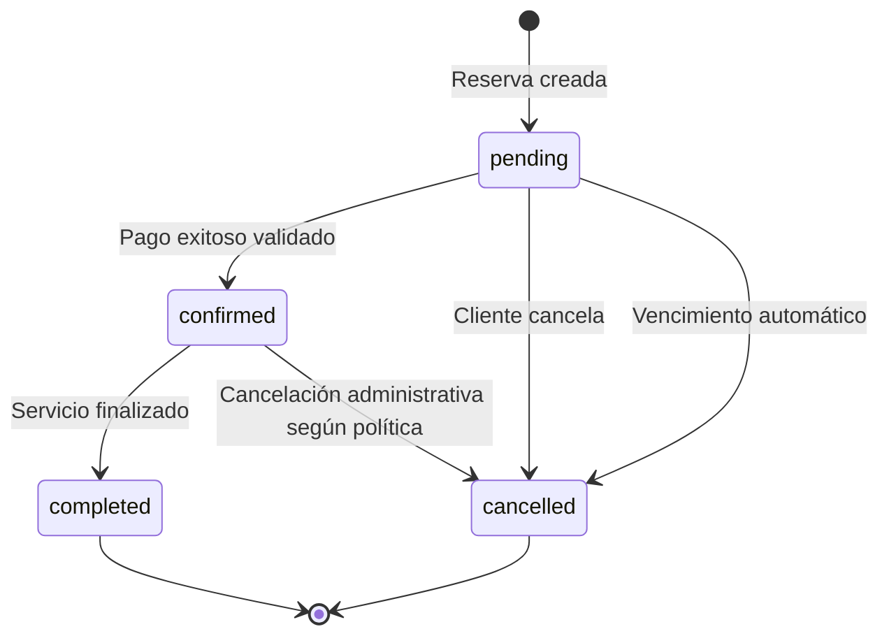

# 03. Requisitos funcionales

## Propósito

Este documento define los requisitos funcionales y las reglas de negocio de DMGOTRAVEL. Los requisitos están alineados con las historias de usuario y con la arquitectura basada en **React + ASP.NET Core + PostgreSQL + Entity Framework Core**.

---

# 1. Requisitos funcionales

| ID | Requisito funcional |
|---|---|
| **RF01** | El sistema debe permitir consultar el catálogo público de ofertas turísticas activas sin autenticación. |
| **RF02** | El sistema debe permitir consultar el detalle de una oferta activa, incluyendo información descriptiva, precio base, imágenes, itinerario y datos necesarios para consultar disponibilidad. |
| **RF03** | El sistema debe permitir registrar clientes con rol `client` mediante correo y contraseña. |
| **RF04** | El sistema debe permitir autenticar usuarios mediante credenciales locales y mediante Google OAuth, emitiendo los tokens propios definidos por DMGOTRAVEL. |
| **RF05** | El sistema debe permitir crear una reserva turística en estado `pending` cuando exista disponibilidad suficiente. |
| **RF06** | El sistema debe calcular en el backend el subtotal turístico utilizando el precio vigente y la cantidad solicitada, conservando el valor utilizado como dato histórico. |
| **RF07** | El sistema debe permitir procesar pagos mediante Culqi y registrar cada intento de pago asociado a una reserva. |
| **RF08** | El sistema debe confirmar una reserva únicamente después de validar un pago exitoso. |
| **RF09** | El sistema debe enviar un comprobante o confirmación al correo del cliente mediante Resend después de un pago confirmado. |
| **RF10** | El sistema debe permitir al cliente consultar únicamente sus propias reservas. |
| **RF11** | El sistema debe permitir al cliente cancelar únicamente sus propias reservas que se encuentren en estado `pending`. |
| **RF12** | El sistema debe permitir al cliente actualizar sus datos personales autorizados y solicitar la eliminación lógica de su cuenta. |
| **RF13** | El sistema debe permitir al administrador crear, modificar, activar y desactivar ofertas turísticas. |
| **RF14** | El sistema debe permitir al administrador consultar todas las reservas y aplicar únicamente transiciones de estado válidas. |
| **RF15** | El sistema debe permitir al administrador consultar clientes y registros de auditoría. |
| **RF16** | El sistema debe calcular indicadores administrativos en el backend y permitir generar un reporte exportable. |
| **RF17** | El sistema debe permitir consultar hoteles activos, tipos de habitación, tarifas e información necesaria para disponibilidad. |
| **RF18** | El sistema debe permitir crear reservas simples de tour o reservas compuestas con alojamiento opcional. |
| **RF19** | El sistema debe calcular el precio total de una reserva compuesta sumando el componente turístico y el alojamiento correspondiente al número de noches y habitaciones. |
| **RF20** | El sistema debe permitir al administrador gestionar hoteles, tipos de habitación, precios e inventario. |
| **RF21** | El sistema debe cancelar automáticamente mediante Hangfire las reservas `pending` cuyo plazo de pago haya vencido. |
| **RF22** | El sistema debe liberar de forma consistente los cupos turísticos y el inventario hotelero cuando una reserva pendiente sea cancelada o expire. |
| **RF23** | El sistema debe registrar en auditoría las operaciones críticas definidas por el negocio. |
| **RF24** | El sistema debe almacenar y gestionar archivos multimedia del catálogo mediante Cloudflare R2. |

---

# 2. Trazabilidad HU → RF

| Historia | Requisitos relacionados |
|---|---|
| HU-01 | RF01 |
| HU-02 | RF02 |
| HU-03 | RF03 |
| HU-04, HU-05 | RF04 |
| HU-06 | RF05, RF06 |
| HU-07 | RF06, RF19 |
| HU-08 | RF07, RF08 |
| HU-09 | RF09 |
| HU-10 | RF10 |
| HU-11 | RF11, RF22 |
| HU-12, HU-13 | RF12 |
| HU-14, HU-15 | RF13, RF23, RF24 |
| HU-16, HU-17 | RF14 |
| HU-18 | RF15, RF23 |
| HU-19 | RF16 |
| HU-20 | RF21, RF22, RF23 |
| HU-21 | RF17 |
| HU-22 | RF18, RF19 |
| HU-23 | RF20, RF24 |

---

# 3. Reglas de negocio

## Catálogo

| ID | Regla |
|---|---|
| **RN-01** | Solo las ofertas, hoteles y tipos de habitación activos y no eliminados lógicamente pueden participar en nuevas reservas. |
| **RN-02** | Los cambios de precio no modifican los importes históricos de reservas ya creadas. |
| **RN-03** | El precio final utilizado en una reserva debe ser calculado por el backend. |

## Reserva turística

| ID | Regla |
|---|---|
| **RN-04** | Toda reserva nueva se crea en estado `pending`. |
| **RN-05** | La fecha o salida turística solicitada debe existir y permitir nuevas reservas. |
| **RN-06** | La cantidad de personas debe ser mayor que cero y no superar la disponibilidad. |
| **RN-07** | Los cupos deben controlarse mediante una operación transaccional que impida sobreventa. |
| **RN-08** | Una reserva `pending` bloquea temporalmente la disponibilidad necesaria. |

## Alojamiento

| ID | Regla |
|---|---|
| **RN-09** | El alojamiento es opcional. |
| **RN-10** | Cuando existe alojamiento, `checkOut` debe ser posterior a `checkIn`. |
| **RN-11** | El inventario hotelero se controla por tipo de habitación y fecha/noche, no únicamente por número de huéspedes. |
| **RN-12** | Una reserva compuesta debe validar y bloquear tour y alojamiento dentro de una única transacción lógica. |
| **RN-13** | Si cualquiera de las validaciones de una reserva compuesta falla, no debe persistirse un bloqueo parcial. |

## Pagos

| ID | Regla |
|---|---|
| **RN-14** | Una reserva solo pasa de `pending` a `confirmed` después de validar un pago exitoso. |
| **RN-15** | Los eventos de pago deben procesarse de manera idempotente. |
| **RN-16** | Un Webhook repetido no puede duplicar la confirmación, el registro de pago ni la notificación. |
| **RN-17** | El backend debe relacionar cada pago con una reserva y conservar los identificadores externos necesarios para trazabilidad. |
| **RN-18** | Los datos sensibles de tarjeta no deben almacenarse en DMGOTRAVEL. |

## Cancelación y vencimiento

| ID | Regla |
|---|---|
| **RN-19** | El cliente puede cancelar directamente únicamente una reserva `pending` que le pertenezca. |
| **RN-20** | Una reserva `pending` cuyo plazo configurable haya vencido debe pasar a `cancelled`. |
| **RN-21** | La cancelación de una reserva pendiente debe liberar los recursos bloqueados. |
| **RN-22** | Las operaciones automáticas de vencimiento deben ser idempotentes. |
| **RN-23** | Una reserva `completed` es terminal. |
| **RN-24** | La cancelación posterior a un pago confirmado debe seguir la política administrativa y de devolución definida para pagos. |

## Seguridad y auditoría

| ID | Regla |
|---|---|
| **RN-25** | Un cliente únicamente puede consultar y modificar recursos que le pertenecen. |
| **RN-26** | Los endpoints administrativos requieren rol `admin`. |
| **RN-27** | Las cuentas administrativas no pueden registrarse públicamente. |
| **RN-28** | Las operaciones críticas deben registrar actor, acción, entidad, identificador, fecha y cambios relevantes. |
| **RN-29** | Los registros de auditoría no pueden ser modificados desde la aplicación. |
| **RN-30** | El borrado de usuarios, ofertas y hoteles que deban conservar historial se realizará de manera lógica. |

---

# 4. Ciclo de vida de una reserva



## Restricción fundamental

```text
pending -> confirmed
```

solo puede ocurrir después de validar correctamente el pago correspondiente.

El administrador **no debe utilizar un cambio manual de estado como sustituto de la confirmación del pago**.

---

# 5. Consistencia transaccional

La creación de una reserva debe garantizar:

```text
BEGIN TRANSACTION

1. Validar estado de la oferta/salida.
2. Bloquear o controlar concurrencia del inventario turístico.
3. Validar cupos.
4. Si existe hotel:
   4.1 Validar rango de fechas.
   4.2 Bloquear/controlar inventario hotelero.
   4.3 Validar disponibilidad para todas las noches.
5. Calcular precio.
6. Crear reserva.
7. Crear sus componentes.
8. Registrar bloqueos de disponibilidad.

COMMIT
```

Ante cualquier error:

```text
ROLLBACK
```

No se permiten reservas parciales.

---

# 6. Datos históricos de precio

Una reserva debe conservar el precio utilizado al momento de su creación.

Ejemplo conceptual:

```text
ReservationItem
- UnitPrice
- Quantity
- Subtotal
```

Si un administrador modifica posteriormente el precio de una oferta o habitación, la reserva histórica no debe cambiar.

---

# 7. Requisitos pendientes de diseño detallado

Los siguientes elementos se especificarán en documentos técnicos posteriores:

- modelo de dominio;
- modelo entidad-relación;
- contratos de API;
- estrategia de tokens y refresh tokens;
- integración detallada de Culqi;
- política de devolución;
- formato del comprobante;
- estrategia de almacenamiento en R2;
- diseño de inventario hotelero;
- diseño de salidas/fechas de tours.


---

# 8. Criterio de exposición de la API

La API REST forma parte del Monolito Modular ASP.NET Core.

El acceso externo se realizará inicialmente mediante:

```text
Cliente
  |
Cloudflare
  |
ASP.NET Core REST API
```

No se requiere un API Gateway independiente en la primera versión.

La incorporación de un Gateway solo se considerará si aparecen nuevas necesidades arquitectónicas, como:

- múltiples backends;
- BFF;
- microservicios;
- enrutamiento avanzado;
- políticas centralizadas que justifiquen una capa adicional.
