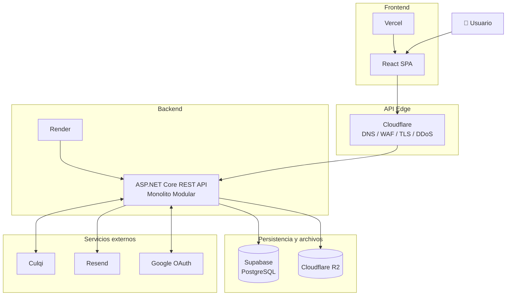
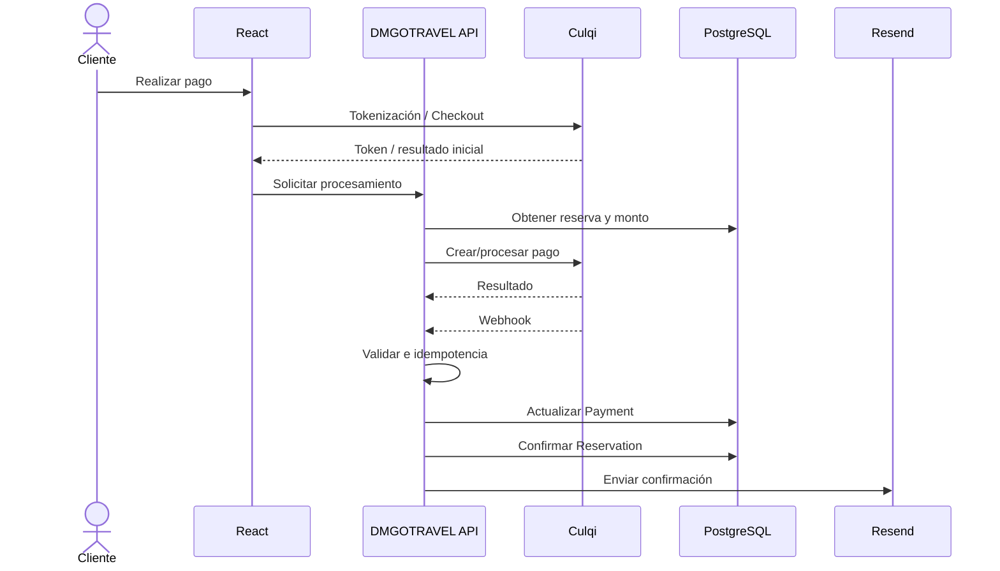

# 11. Arquitectura de despliegue

## Propósito

Definir cómo se desplegarán los componentes de DMGOTRAVEL en la primera versión de producción.

---

# 1. Topología



---

# 2. Dominios

```text
dmgotravel.com
www.dmgotravel.com
    -> Vercel / React
```

```text
api.dmgotravel.com
    -> Cloudflare Proxy
    -> Render / ASP.NET Core
```

---

# 3. Cloudflare

Para la API, Cloudflare proporcionará:

- DNS;
- proxy;
- TLS;
- WAF;
- DDoS;
- reglas de seguridad.

Para el frontend alojado en Vercel, Cloudflare puede usarse como proveedor DNS sin introducir necesariamente un proxy adicional delante de Vercel.

---

# 4. Render

Render alojará el contenedor Docker del backend.

```text
Docker
  |
  v
ASP.NET Core
  |
  v
DMGOTRAVEL Monolith
```

El backend deberá ser stateless respecto al servidor.

---

# 5. Supabase

El acceso será desde el backend mediante:

```text
EF Core
Npgsql
Connection String
```

El frontend no accede directamente a las tablas del sistema.

---

# 6. R2

Cloudflare R2 almacenará:

- imágenes de tours;
- imágenes de hoteles;
- multimedia.

El backend almacenará referencias en PostgreSQL.

---

# 7. Secretos

Ejemplos:

```text
ConnectionStrings__DefaultConnection
Jwt__Key
Jwt__Issuer
Jwt__Audience
Culqi__PublicKey
Culqi__SecretKey
Resend__ApiKey
Google__ClientId
Google__ClientSecret
R2__AccountId
R2__AccessKeyId
R2__SecretAccessKey
R2__BucketName
```

Nunca se almacenarán secretos reales en GitHub.

---

# 8. Flujo de pago



---

# 9. Flujo de vencimiento

```text
Hangfire
   |
   v
Buscar reservas pending vencidas
   |
   v
Cancelar reserva
   |
   +--> liberar cupos
   +--> liberar inventario hotelero
   +--> auditoría
```

Hangfire se ejecuta dentro del mismo backend.

---

# 10. Evolución

Si el sistema aumenta significativamente su escala, podrán evaluarse:

- escalado horizontal;
- caché distribuida;
- workers separados;
- API Gateway;
- colas;
- servicios independientes.

Estas opciones no forman parte de la primera versión.
