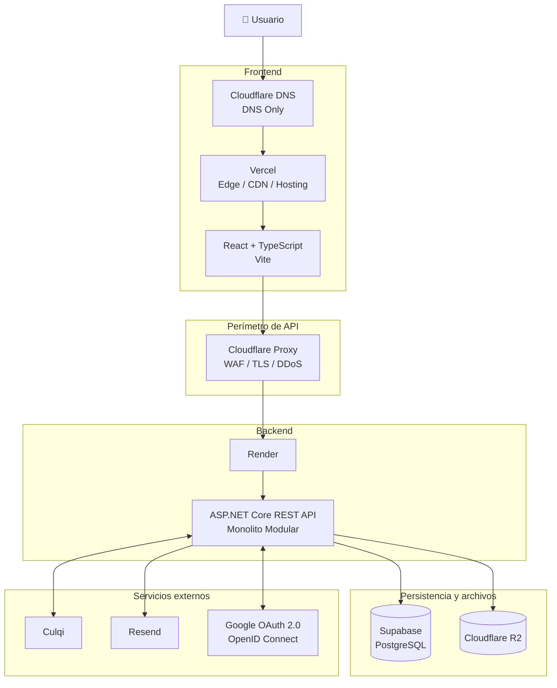
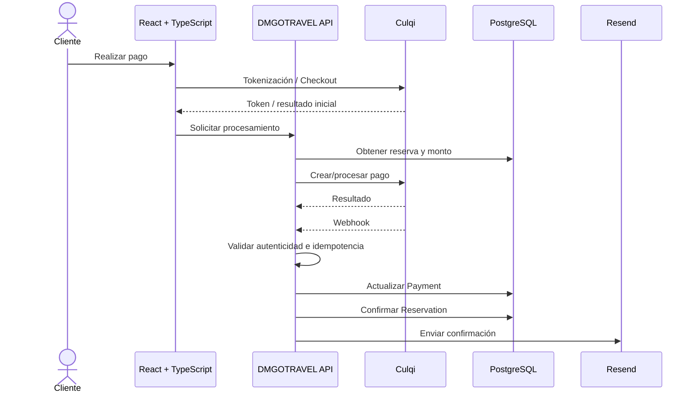

# 11. Arquitectura de despliegue

## Propósito

Definir cómo se desplegarán los componentes de **DMGOTRAVEL** en la primera versión de producción.

La arquitectura mantiene un único backend de negocio basado en ASP.NET Core y diferencia claramente el flujo del frontend del flujo de la API.

---

# 1. Topología



---

# 2. Dominios

## 2.1 Frontend

```text
dmgotravel.com
www.dmgotravel.com
    -> Cloudflare DNS
    -> Vercel
    -> React + TypeScript
```

Cloudflare se utilizará como proveedor DNS y Vercel proporcionará hosting y Edge/CDN del frontend.

---

## 2.2 API

```text
api.dmgotravel.com
    -> Cloudflare Proxy/WAF
    -> Render
    -> ASP.NET Core REST API
```

La API constituye la capa Presentation del mismo Monolito Modular.

---

# 3. Cloudflare

Cloudflare tendrá dos usos claramente diferenciados.

## 3.1 Frontend

Para:

```text
dmgotravel.com
www.dmgotravel.com
```

Cloudflare administrará DNS.

Configuración conceptual:

```text
Cloudflare DNS
    |
DNS Only
    |
Vercel
```

No se añadirá inicialmente un proxy Cloudflare delante de Vercel.

---

## 3.2 API

Para:

```text
api.dmgotravel.com
```

Cloudflare actuará como proxy y capa perimetral.

Responsabilidades:

- DNS;
- proxy HTTP/HTTPS;
- TLS;
- WAF;
- mitigación DDoS;
- reglas de seguridad;
- rate limiting perimetral cuando corresponda.

Cloudflare no contendrá lógica de negocio.

---

# 4. Vercel

Vercel alojará:

```text
React
TypeScript
Vite build
```

Responsabilidades:

- hosting frontend;
- entrega mediante Edge/CDN;
- despliegues del frontend;
- variables de entorno del cliente cuando corresponda.

El frontend consumirá:

```text
https://api.dmgotravel.com
```

No tendrá acceso directo a PostgreSQL.

---

# 5. Render

Render alojará el contenedor Docker del backend.

```text
Docker
  |
  v
ASP.NET Core
  |
  v
DMGOTRAVEL Monolith
```

El backend deberá ser stateless respecto al servidor.

No se utilizará el disco local de Render como almacenamiento persistente de negocio.

---

# 6. Supabase

Supabase alojará PostgreSQL.

El acceso será exclusivamente desde el backend mediante:

```text
Entity Framework Core
Npgsql
Connection String
```

El frontend no accederá directamente a las tablas del sistema.

---

# 7. Cloudflare R2

Cloudflare R2 almacenará:

- imágenes de tours;
- imágenes de hoteles;
- recursos multimedia.

El backend almacenará referencias y metadatos en PostgreSQL.

---

# 8. Servicios externos

## 8.1 Culqi

```text
React
  |
Tokenización / Checkout
  |
Culqi
```

y:

```text
ASP.NET Core
  |
Culqi API
```

Los Webhooks entrarán mediante:

```text
Culqi
  |
api.dmgotravel.com
  |
Cloudflare Proxy/WAF
  |
ASP.NET Core
```

---

## 8.2 Resend

```text
ASP.NET Core
  |
Resend API
```

---

## 8.3 Google

```text
Usuario
  |
Google OAuth 2.0 / OpenID Connect
  |
ASP.NET Core Identity
  |
JWT DMGOTRAVEL
```

---

# 9. Secretos

Ejemplos:

```text
ConnectionStrings__DefaultConnection

Jwt__Key
Jwt__Issuer
Jwt__Audience

Culqi__PublicKey
Culqi__SecretKey

Resend__ApiKey

Google__ClientId
Google__ClientSecret

R2__AccountId
R2__AccessKeyId
R2__SecretAccessKey
R2__BucketName
```

Nunca se almacenarán secretos reales en GitHub.

---

# 10. Flujo de pago



---

# 11. Flujo de vencimiento

```text
Hangfire
   |
   v
Buscar reservas pending vencidas
   |
   v
Cancelar reserva
   |
   +--> liberar cupos
   +--> liberar inventario hotelero
   +--> auditoría
```

Hangfire se ejecuta dentro del mismo backend.

---

# 12. API Gateway

No se implementará un API Gateway independiente en la primera versión.

```text
Internet
   |
Cloudflare
   |
ASP.NET Core REST API
```

La decisión podrá revisarse únicamente si aparecen necesidades como:

- múltiples backends;
- BFF;
- microservicios;
- APIs especializadas;
- routing avanzado;
- políticas centralizadas que justifiquen una capa adicional.

---

# 13. Evolución

Si el sistema aumenta significativamente su escala, podrán evaluarse:

- escalado horizontal;
- caché distribuida;
- workers separados;
- API Gateway;
- colas;
- servicios independientes.

Estas opciones no forman parte de la primera versión.
