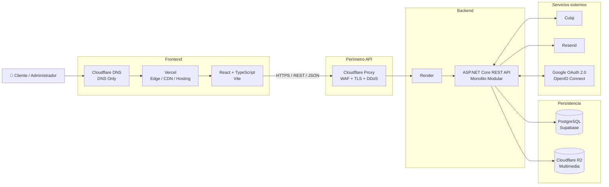
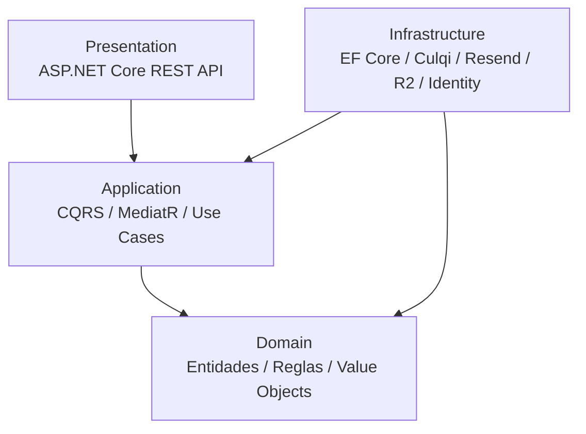

# 08. Arquitectura inicial

## Propósito

Este documento define la arquitectura inicial de **DMGOTRAVEL** a partir de las decisiones adoptadas en el análisis del sistema.

La solución se implementará como una aplicación web con:

- **Frontend:** React + TypeScript.
- **Build tool frontend:** Vite.
- **Backend:** ASP.NET Core.
- **Estilo de backend:** Monolito Modular.
- **Enfoque interno:** Clean Architecture.
- **Patrón de aplicación:** CQRS con MediatR.
- **Persistencia:** PostgreSQL mediante Entity Framework Core.
- **Background Jobs:** Hangfire.
- **Pagos:** Culqi.
- **Correo:** Resend.
- **Multimedia:** Cloudflare R2.
- **Hosting frontend:** Vercel.
- **Hosting backend:** Render.
- **DNS:** Cloudflare.
- **Perímetro de la API:** Cloudflare Proxy/WAF.
- **API Gateway independiente:** no requerido en la primera versión.

---

# 1. Vista general

DMGOTRAVEL se organiza en cuatro zonas principales:

```text
1. Frontend
2. Capa perimetral de la API
3. Backend monolítico
4. Persistencia e integraciones externas
```



---

# 2. Flujo de acceso

## 2.1 Frontend

El frontend se publicará en:

```text
https://dmgotravel.com
https://www.dmgotravel.com
```

Flujo:

```text
Usuario
   |
   v
Cloudflare DNS
DNS Only
   |
   v
Vercel
Edge / CDN / Hosting
   |
   v
React + TypeScript
```

Cloudflare administrará el DNS, pero no se añadirá inicialmente como proxy adicional delante de Vercel.

Vercel será responsable del hosting y de su infraestructura Edge/CDN para el frontend.

---

## 2.2 API

La API se publicará mediante:

```text
https://api.dmgotravel.com
```

Flujo:

```text
React + TypeScript
        |
        v
Cloudflare Proxy
WAF + TLS + DDoS
        |
        v
Render
        |
        v
ASP.NET Core REST API
Monolito Modular
```

En esta primera versión **no existe un API Gateway independiente**.

---

# 3. Backend monolítico

El backend constituye una sola aplicación desplegable.

```text
DMGOTRAVEL Backend
|
+-- Identity
+-- Catalog
+-- Hotels
+-- Reservations
+-- Payments
+-- Notifications
+-- Reports
+-- Audit
+-- Background Jobs
```

Todos los módulos forman parte de la misma solución, se despliegan juntos y utilizan la misma persistencia PostgreSQL.

Esto corresponde a un **Monolito Modular**, no a microservicios.

---

# 4. Módulos funcionales

| Módulo | Responsabilidad |
|---|---|
| **Identity** | Usuarios, autenticación, roles y Google OAuth/OIDC. |
| **Catalog** | Tours, servicios, paquetes e imágenes. |
| **Hotels** | Hoteles, tipos de habitación, tarifas e inventario. |
| **Reservations** | Reservas, disponibilidad y ciclo de vida. |
| **Payments** | Culqi, pagos, eventos e idempotencia. |
| **Notifications** | Correos transaccionales mediante Resend. |
| **Reports** | Indicadores y reportes. |
| **Audit** | Registro de operaciones críticas. |
| **Background Jobs** | Vencimiento de reservas y tareas con Hangfire. |

---

# 5. Clean Architecture

```text
Presentation
Application
Domain
Infrastructure
```



---

# 6. Persistencia

```text
PostgreSQL
Supabase
Entity Framework Core
Npgsql
```

El backend será el único responsable de acceder a la base de datos.

```text
React + TypeScript
        |
        v
REST API
        |
        v
ASP.NET Core
        |
        v
EF Core
        |
        v
PostgreSQL
```

---

# 7. Servicios externos

## Culqi

Los Webhooks serán recibidos por la propia API.

```text
POST /api/v1/webhooks/culqi
```

## Resend

```text
ASP.NET Core
  |
  v
Resend API
```

## Cloudflare R2

```text
ASP.NET Core
  |
  v
Cloudflare R2
```

## Google

```text
Usuario
  |
Google OAuth 2.0 / OpenID Connect
  |
ASP.NET Core
  |
JWT propio de DMGOTRAVEL
```

---

# 8. Background Jobs

Hangfire formará parte del mismo backend monolítico.

```text
DMGOTRAVEL Monolith
|
+-- API REST
+-- CQRS
+-- EF Core
+-- Hangfire
```

Hangfire no constituye un microservicio separado.

---

# 9. Evolución futura

La primera versión no requiere:

- microservicios;
- service mesh;
- API Gateway independiente;
- event bus distribuido;
- múltiples bases de datos por módulo.

Un API Gateway podrá evaluarse si aparecen múltiples APIs, BFF, microservicios o necesidades avanzadas de routing.
