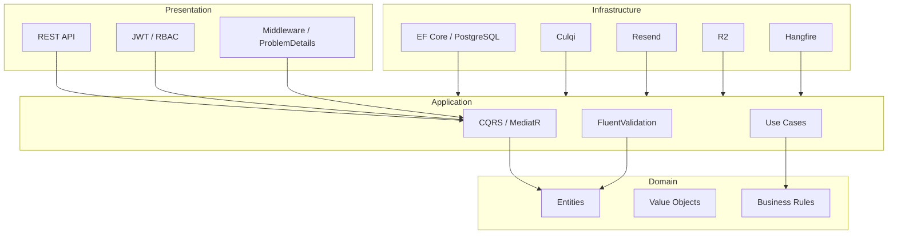

# 10. Enfoque arquitectónico

## Propósito

DMGOTRAVEL utilizará **Clean Architecture** para organizar internamente el Monolito Modular ASP.NET Core.

---

# 1. Estructura

```text
Presentation
    |
    v
Application
    |
    v
Domain

Infrastructure
    |
    +--> Application
    +--> Domain
```

---

# 2. Domain

Contiene el núcleo del negocio.

Ejemplos:

```text
User
Offer
TourDeparture
Hotel
RoomType
RoomInventory
Reservation
Payment
Notification
AuditLog
```

Domain no debe depender de:

```text
ASP.NET Core
Entity Framework Core
PostgreSQL
Culqi
Resend
Cloudflare
Render
Vercel
```

---

# 3. Application

Contiene:

- Commands;
- Queries;
- Handlers;
- DTOs;
- FluentValidation;
- interfaces;
- casos de uso.

Tecnologías:

```text
MediatR
FluentValidation
```

---

# 4. Infrastructure

Implementa los detalles externos.

Ejemplos:

```text
AppDbContext
EF Core
CulqiPaymentGateway
ResendEmailService
R2ObjectStorage
GoogleIdentityProvider
Hangfire Jobs
```

---

# 5. Presentation

Expone la API REST.

Incluye:

- Controllers o endpoints;
- JWT;
- autorización;
- CORS;
- rate limiting;
- middleware;
- OpenAPI;
- ProblemDetails;
- versionado.

---

# 6. Diagrama



---

# 7. Flujo de una solicitud

```text
HTTP POST
  |
  v
ReservationsController
  |
  v
CreateReservationCommand
  |
  v
CreateReservationHandler
  |
  v
Domain Rules
  |
  v
Infrastructure / EF Core
  |
  v
PostgreSQL
```

---

# 8. Dependencias permitidas

```text
Presentation -> Application
Application  -> Domain
Infrastructure -> Application
Infrastructure -> Domain
```

No permitido:

```text
Domain -> Infrastructure
Domain -> Presentation
Application -> Presentation
```

---

# 9. Relación con Monolito Modular

Clean Architecture define las capas técnicas.

El Monolito Modular define los límites funcionales.

Los módulos pueden organizarse internamente dentro de una única solución y seguir formando parte del mismo proceso desplegable.

No existe un despliegue separado por módulo en la primera versión.
