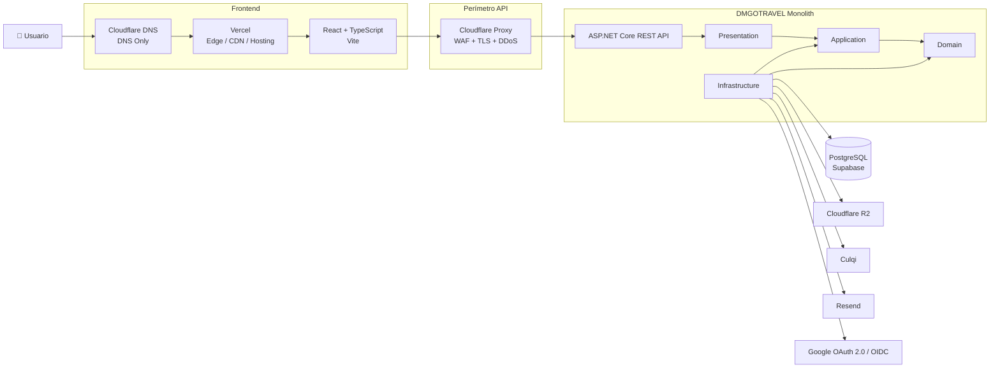

# 09. Estilo arquitectónico

## Propósito

DMGOTRAVEL combina estilos y patrones para resolver la distribución física de la solución y la organización interna del backend.

La arquitectura utiliza:

1. **Cliente-Servidor**.
2. **Monolito Modular**.
3. **Clean Architecture**.
4. **CQRS**.

La primera versión mantiene un único backend de negocio y no utiliza microservicios ni un API Gateway independiente.

---

# 1. Cliente-Servidor

DMGOTRAVEL separa la interfaz web del backend.

```text
React + TypeScript
Vite
   |
HTTPS / REST / JSON
   |
Cloudflare Proxy/WAF
   |
ASP.NET Core REST API
```

## Cliente

Responsabilidades:

- interfaz;
- navegación;
- formularios;
- estado visual;
- validaciones de experiencia de usuario;
- consumo de la API REST;
- presentación de estados de reservas y pagos.

Tecnología:

```text
React
TypeScript
Vite
Vercel
```

### Despliegue del cliente

```text
Usuario
   |
   v
Cloudflare DNS
DNS Only
   |
   v
Vercel
Edge / CDN / Hosting
   |
   v
React + TypeScript
```

Cloudflare administrará DNS, mientras que Vercel proporcionará el hosting y Edge/CDN del frontend.

No se añadirá inicialmente un proxy Cloudflare delante de Vercel.

---

## Servidor

Responsabilidades:

- autenticación;
- autorización;
- reglas de negocio;
- catálogo;
- hoteles;
- reservas;
- disponibilidad;
- pagos;
- notificaciones;
- auditoría;
- reportes;
- persistencia;
- integraciones externas;
- trabajos en segundo plano.

Tecnología:

```text
ASP.NET Core
C#
Render
Docker
```

### Acceso a la API

```text
React + TypeScript
        |
        v
api.dmgotravel.com
        |
        v
Cloudflare Proxy/WAF
        |
        v
Render
        |
        v
ASP.NET Core REST API
```

Cloudflare protege el perímetro de la API, pero no contiene lógica de negocio.

---

# 2. Monolito Modular

El backend se implementa como **una única aplicación desplegable**.

```text
DMGOTRAVEL MONOLITH
|
+-- Identity
+-- Catalog
+-- Hotels
+-- Reservations
+-- Payments
+-- Notifications
+-- Reports
+-- Audit
+-- Background Jobs
```

Los módulos son separaciones lógicas, no servicios independientes.

Por tanto:

```text
Identity        != microservicio
Catalog         != microservicio
Hotels          != microservicio
Reservations    != microservicio
Payments        != microservicio
Notifications   != microservicio
```

Todos los módulos:

- pertenecen al mismo backend;
- se despliegan juntos;
- ejecutan dentro de la misma aplicación;
- utilizan PostgreSQL como persistencia principal;
- respetan límites funcionales internos.

---

# 3. Clean Architecture

La organización técnica del backend utiliza:

```text
Presentation
Application
Domain
Infrastructure
```

| Capa | Responsabilidad |
|---|---|
| **Domain** | Entidades, Value Objects, invariantes y reglas del negocio. |
| **Application** | Casos de uso, Commands, Queries, DTOs, validaciones y contratos. |
| **Infrastructure** | EF Core, PostgreSQL, Identity, Culqi, Resend, R2 y Hangfire. |
| **Presentation** | API REST, endpoints, autenticación, autorización, middleware y HTTP. |

### Dependencias permitidas

```text
Presentation -> Application
Application  -> Domain
Infrastructure -> Application
Infrastructure -> Domain
```

### Dependencias no permitidas

```text
Domain -> Infrastructure
Domain -> Presentation
Application -> Presentation
```

Las reglas del dominio no dependen de proveedores externos ni detalles de hosting.

---

# 4. CQRS

Dentro de Application se separarán las operaciones de escritura y lectura.

## Commands

Ejemplos:

```text
CreateReservationCommand
CancelReservationCommand
ConfirmPaymentCommand
CreateHotelCommand
UpdateOfferCommand
```

## Queries

Ejemplos:

```text
GetCatalogQuery
GetOfferByIdQuery
GetHotelsQuery
GetMyReservationsQuery
GetAdminReservationsQuery
```

CQRS se utilizará para organizar los casos de uso del Monolito Modular.

CQRS no implica:

- microservicios;
- múltiples bases de datos;
- mensajería distribuida;
- event sourcing;
- buses externos.

---

# 5. API REST

La API REST forma parte de la capa **Presentation** del monolito.

```text
DMGOTRAVEL
|
+-- Presentation
|   +-- REST API
|
+-- Application
+-- Domain
+-- Infrastructure
```

La API REST **no es otro sistema ni otro servicio de negocio separado**.

Rutas conceptuales:

```text
/api/v1/auth
/api/v1/catalog
/api/v1/hotels
/api/v1/reservations
/api/v1/payments
/api/v1/admin
/api/v1/webhooks
```

La API utilizará:

- HTTPS;
- JSON;
- JWT;
- RBAC;
- CORS restrictivo;
- rate limiting;
- OpenAPI;
- ProblemDetails;
- logging estructurado;
- CorrelationId.

---

# 6. Capa perimetral

Cloudflare se utiliza delante de la API para responsabilidades de infraestructura.

```text
Internet
   |
Cloudflare Proxy/WAF
   |
Render
   |
ASP.NET Core REST API
```

Cloudflare proporcionará para la API:

- DNS;
- proxy HTTP/HTTPS;
- TLS;
- WAF;
- mitigación DDoS;
- filtrado;
- reglas perimetrales;
- rate limiting perimetral cuando corresponda.

Cloudflare **no implementa**:

- autenticación de dominio;
- reglas de reserva;
- lógica de pagos;
- CQRS;
- acceso a PostgreSQL;
- lógica de inventario.

Estas responsabilidades permanecen en ASP.NET Core.

---

# 7. Relación entre componentes



---

# 8. Despliegue

La primera versión utiliza:

```text
Frontend
  React + TypeScript
  Vite
  Vercel

API Edge
  Cloudflare Proxy/WAF

Backend
  ASP.NET Core
  Monolito Modular
  Docker
  Render

Persistencia
  PostgreSQL
  Supabase

Archivos
  Cloudflare R2

Integraciones
  Culqi
  Resend
  Google OAuth 2.0 / OpenID Connect
```

No se implementa un API Gateway independiente en V1.

---

# 9. Evolución

La evolución prevista prioriza optimizar el monolito antes de introducir arquitectura distribuida.

```text
Monolito Modular
      |
      v
Optimización del monolito
      |
      v
Escalado vertical
      |
      v
Escalado horizontal
      |
      v
Caché distribuida si existe necesidad
      |
      v
Workers separados si existe necesidad
      |
      v
API Gateway si existe justificación
      |
      v
Extracción selectiva de servicios
```

La adopción de microservicios no se considera un objetivo por sí mismo.

Cualquier cambio que introduzca:

- microservicios;
- API Gateway;
- Redis;
- RabbitMQ;
- Kafka;
- Kubernetes;

deberá justificarse mediante una nueva ADR.
