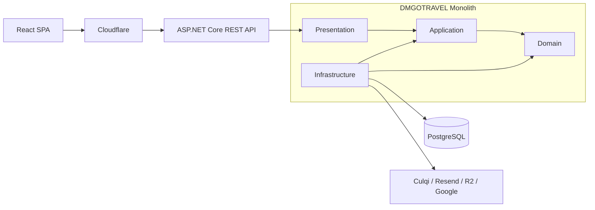

# 09. Estilo arquitectónico

## Propósito

DMGOTRAVEL combina estilos y patrones para resolver la distribución física y la organización interna del backend.

La arquitectura utiliza:

1. **Cliente-Servidor**.
2. **Monolito Modular**.
3. **Clean Architecture**.
4. **CQRS**.

---

# 1. Cliente-Servidor

```text
React SPA
   |
HTTPS / REST / JSON
   |
ASP.NET Core
```

## Cliente

Responsabilidades:

- interfaz;
- navegación;
- formularios;
- estado visual;
- consumo de la API.

Tecnología:

```text
React
Vercel
```

## Servidor

Responsabilidades:

- autenticación;
- autorización;
- reglas de negocio;
- reservas;
- disponibilidad;
- pagos;
- auditoría;
- persistencia;
- integraciones.

Tecnología:

```text
ASP.NET Core
C#
Render
```

---

# 2. Monolito Modular

El backend se implementa como **una única aplicación desplegable**.

```text
DMGOTRAVEL MONOLITH
|
+-- Identity
+-- Catalog
+-- Hotels
+-- Reservations
+-- Payments
+-- Notifications
+-- Reports
+-- Audit
```

Los módulos son separaciones lógicas, no servicios independientes.

---

# 3. Clean Architecture

| Capa | Responsabilidad |
|---|---|
| **Domain** | Entidades, Value Objects y reglas del negocio. |
| **Application** | Casos de uso, Commands, Queries, DTOs y contratos. |
| **Infrastructure** | EF Core, PostgreSQL, Culqi, Resend, R2, Identity y Hangfire. |
| **Presentation** | API REST, endpoints, middleware y HTTP. |

---

# 4. CQRS

## Commands

```text
CreateReservationCommand
CancelReservationCommand
ConfirmPaymentCommand
CreateHotelCommand
UpdateOfferCommand
```

## Queries

```text
GetCatalogQuery
GetOfferByIdQuery
GetHotelsQuery
GetMyReservationsQuery
GetAdminReservationsQuery
```

CQRS no implica microservicios, múltiples bases de datos ni mensajería distribuida.

---

# 5. API REST

La API REST forma parte de la capa Presentation del monolito.

```text
DMGOTRAVEL
|
+-- Presentation
|   +-- REST API
|
+-- Application
+-- Domain
+-- Infrastructure
```

La API REST **no es otro sistema separado**.

Rutas conceptuales:

```text
/api/v1/auth
/api/v1/catalog
/api/v1/hotels
/api/v1/reservations
/api/v1/payments
/api/v1/admin
/api/v1/webhooks
```

---

# 6. Capa perimetral

Cloudflare se utiliza delante de la API para:

- DNS;
- TLS;
- WAF;
- mitigación DDoS;
- reglas perimetrales.

```text
Internet
   |
Cloudflare
   |
ASP.NET Core REST API
```

No se añade un API Gateway independiente en la primera versión.

---

# 7. Relación entre componentes



---

# 8. Evolución

```text
Monolito Modular
      |
      v
Escalado del monolito
      |
      v
Optimización de módulos
      |
      v
Separación de workers si es necesario
      |
      v
Extracción selectiva de servicios
```

La adopción de microservicios no se considera un objetivo por sí mismo.
